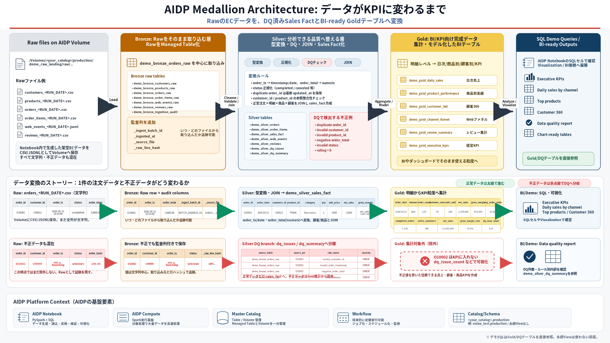

# Oracle AIDP Medallion Architecture Demo

Oracle AI Data Platform Workbench (AIDP) で、EC/小売データを題材にした Medallion Architecture を体験するためのデモです。

このリポジトリには、AIDP Notebook、実行手順書、確認用SQL、データ変換イメージ図が含まれています。外部データを事前に用意しなくても、Notebook内でサンプルデータを生成し、Raw -> Bronze -> Silver -> Gold の流れを一通り実行できます。



## What You Will Build

このデモでは、架空のオンラインショップを想定し、以下のデータを扱います。

| データ | 内容 |
|---|---|
| Customers | 顧客マスタ |
| Products | 商品マスタ |
| Orders | 注文ヘッダ |
| Order Items | 注文明細 |
| Web Events | Web行動ログ |
| Reviews | 商品レビュー |

Notebookを実行すると、AIDP上に次の流れでデータが作成されます。

```text
Raw files on Managed Volume
  -> Bronze managed tables
  -> Silver managed tables with data quality checks
  -> Gold managed tables for BI/KPI
```

## Repository Contents

| ファイル | 用途 |
|---|---|
| `aidp_medallion_demo_cells.ipynb` | AIDPへインポートして実行するNotebook |
| `aidp_medallion_demo_cells.md` | NotebookセルをMarkdownで確認・コピーするためのファイル |
| `AIDP_Medallion_Demo_Runbook.md` | AIDPで一から実行するための手順書 |
| `AIDP_Medallion_Demo_Runbook.docx` | 共有用のWord版手順書 |
| `aidp_medallion_demo_queries_and_cleanup.sql` | 追加確認SQLとクリーンアップSQL |
| `aidp_medallion_data_transformation.svg` | データ変換イメージ図 |
| `aidp_medallion_data_transformation_preview.png` | README表示用のプレビュー画像 |

## Prerequisites

事前に以下が必要です。

- Oracle AI Data Platform Workbenchを利用できること
- AIDP WorkspaceでNotebookを作成またはインポートできること
- Spark ComputeをNotebookにアタッチできること
- Master CatalogでCatalog、Schema、Managed Volumeを作成できること

このデモでは実データ、実顧客データ、秘密情報は使いません。Notebook内で合成したサンプルデータだけを使用します。

## Quick Start

### 1. AIDP上に作成する名前を決める

例として以下の名前を使えます。実際には各自の名前に合わせて変更してください。

| 項目 | 例 |
|---|---|
| Workspace folder | `/Shared/odisv/<your_name>` |
| Notebook | `aidp_medallion_demo.ipynb` |
| Catalog | `sniwa_test` |
| Schema | `production` |
| Raw Volume | `demo_raw_landing` |
| Artifact Volume | `demo_artifacts` |

Notebook内では、Catalog名だけを自分の環境に合わせて変更します。

```python
CATALOG = "sniwa_test"
SCHEMA = "production"
```

### 2. AIDP UIでアセットを作成する

AIDP UIで以下を作成します。

1. Workspace内の `/Shared/odisv/` 配下に、各自の名前のフォルダを作成する
2. そのフォルダにNotebookを作成、または `aidp_medallion_demo_cells.ipynb` をインポートする
3. Master Catalogで各自のCatalogを作成する
4. Catalog配下にSchema `production` を作成する
5. Schema `production` 配下にManaged Volumeを2つ作成する

作成するVolume:

| Volume | 用途 |
|---|---|
| `demo_raw_landing` | Raw CSV/JSONLファイル置き場 |
| `demo_artifacts` | Gold出力やデモ成果物置き場 |

Volume作成はNotebookのPythonセルからではなく、AIDP UIから実施します。

### 3. Notebookを実行する

`aidp_medallion_demo_cells.ipynb` をAIDPにインポートし、上から順番に実行します。

実行の流れ:

1. Demo configurationでCatalog名を変更する
2. Volume POSIXパスが見えることを確認する
3. サンプルECデータを生成する
4. RawファイルをManaged Volumeへ書き込む
5. Bronzeテーブルを作成する
6. SilverテーブルとDQテーブルを作成する
7. Goldテーブルを作成する
8. PythonとSQLの両方で同じ結果を確認する
9. 任意でArtifact VolumeへGold結果を出力する

## Created Tables

### Bronze

BronzeはRawをなるべくそのまま取り込む層です。監査列として `_ingest_batch_id`, `_ingested_at`, `_source_file`, `_source_name`, `_raw_line_hash` を付与します。

```text
demo_bronze_customers_raw
demo_bronze_products_raw
demo_bronze_orders_raw
demo_bronze_order_items_raw
demo_bronze_web_events_raw
demo_bronze_reviews_raw
demo_bronze_ingestion_audit
```

### Silver

Silverでは型変換、重複排除、参照整合性チェック、不正データ分離、売上ファクト作成を行います。

```text
demo_silver_customers
demo_silver_products
demo_silver_orders
demo_silver_order_items
demo_silver_sales_fact
demo_silver_web_events
demo_silver_reviews
demo_silver_dq_issues
demo_silver_dq_summary
```

### Gold

GoldはBIや業務ユーザー向けの集計済みデータです。

```text
demo_gold_daily_sales
demo_gold_product_performance
demo_gold_customer_360
demo_gold_channel_funnel
demo_gold_review_summary
demo_gold_executive_kpis
```

## Data Quality Examples

Medallion Architectureの価値を見せるため、Rawには少量の不正データを意図的に混ぜています。

| 種類 | 例 | Silverでの扱い |
|---|---|---|
| 重複注文 | 同じ `order_id` が複数行 | 最新の `updated_at` を採用 |
| 存在しない顧客 | `customer_id = C99999` | DQ issueとして記録し、有効注文から除外 |
| 存在しない商品 | `product_id = P99999` | DQ issueとして記録し、有効明細から除外 |
| 不正な金額 | `order_total = -100.00` | DQ issueとして記録し、有効注文から除外 |
| 不正な数量 | `quantity = 0` | DQ issueとして記録し、有効明細から除外 |
| 不正な日時 | `order_ts = not_a_timestamp` | DQ issueとして記録し、有効データから除外 |
| 不正なステータス | `status = unknown` | DQ issueとして記録し、有効注文から除外 |
| 不正なイベント | `event_type = teleport` | DQ issueとして記録し、有効Webイベントから除外 |
| 不正なレビュー評価 | `rating = 6` | DQ issueとして記録し、有効レビューから除外 |

DQ結果は以下で確認できます。

```sql
SELECT *
FROM demo_silver_dq_summary
ORDER BY issue_count DESC;
```

## Demo Queries

Gold作成後、Notebook内のSQLセルで以下のような確認ができます。

```sql
SELECT *
FROM demo_gold_executive_kpis;
```

```sql
SELECT *
FROM demo_gold_daily_sales
ORDER BY order_date, channel;
```

```sql
SELECT *
FROM demo_gold_product_performance
ORDER BY net_sales DESC, product_id
LIMIT 10;
```

Notebookには、PySpark DataFrame API版とSQLセル版の両方を残しています。同じ結果が得られることを比較できるため、Python利用者にもSQL利用者にも説明しやすい構成です。

## Visualization

AIDP Notebook側にVisualization機能がある場合は、Goldテーブルや集計表の結果から折れ線グラフ、棒グラフなどを作成できます。

例:

- `demo_gold_daily_sales` の `order_date` x `net_sales` で日次売上推移
- `demo_gold_product_performance` の `product_name` x `net_sales` で商品別売上
- `demo_silver_dq_summary` の `rule_name` x `issue_count` でDQエラー件数

`matplotlib` がComputeに入っていない環境でも、Notebookの表表示とVisualization機能でデモを進められるようにしています。

## Optional: ADW / Autonomous Database Reference Catalog

AIDPにAutonomous Data WarehouseやAutonomous DatabaseをExternal Catalogとして登録すると、AIDP Notebookから既存DB内のテーブルを参照できます。

最初は書き込みではなく、参照専用ユーザーを作ってCatalog登録するのがおすすめです。

構成イメージ:

```text
ADW sample schema
  -> AIDP External Catalog
  -> AIDP Notebook SQL cell
  -> SELECT/JOIN/preview
```

注意:

- Wallet、DBパスワード、接続文字列はGitHubにコミットしないでください。
- 既存スキーマを削除せず、デモ専用スキーマと参照専用ユーザーを作るのが安全です。
- AIDPから見えない場合は、AIDP側のCatalog権限と、ADW側のDBユーザー権限の両方を確認してください。

## Troubleshooting

### Volume path was not found

Catalog、Schema、Managed Volumeのいずれかが存在しない可能性があります。

確認するもの:

```text
/Volumes/<your_catalog>/production/demo_raw_landing
/Volumes/<your_catalog>/production/demo_artifacts
```

### Catalog does not support views

AIDP環境によっては永続Viewをサポートしない場合があります。このNotebookではデモクエリをGold/DQテーブル直接参照にしているため、View作成が使えなくてもデモを続行できます。

### USE CATALOG fails

環境によっては `USE CATALOG` が失敗し、`USE <catalog>.<schema>` が使える場合があります。Notebook内のBootstrap処理はこの差異を吸収するようにしています。

### matplotlib is not installed

Optional chartsセルは、`matplotlib` がない場合も表形式の集計結果を表示します。Notebook側のVisualization機能があれば、その表からグラフ化してください。

## Cleanup

デモ資産を削除したい場合は、Notebook末尾のCleanupセル、または `aidp_medallion_demo_queries_and_cleanup.sql` を確認してください。

削除対象は `demo_*` のデモ用オブジェクトに限定しています。既存業務テーブルを対象にしないよう、実行前にCatalogとSchemaを必ず確認してください。

## Security Notes

Do not commit:

- Oracle Wallet files
- DB passwords
- OCI API keys
- private keys
- `.env` files
- real customer data
- tenancy/user OCIDs that should not be public

This repository is intended to contain only synthetic demo data and reusable demo instructions.
