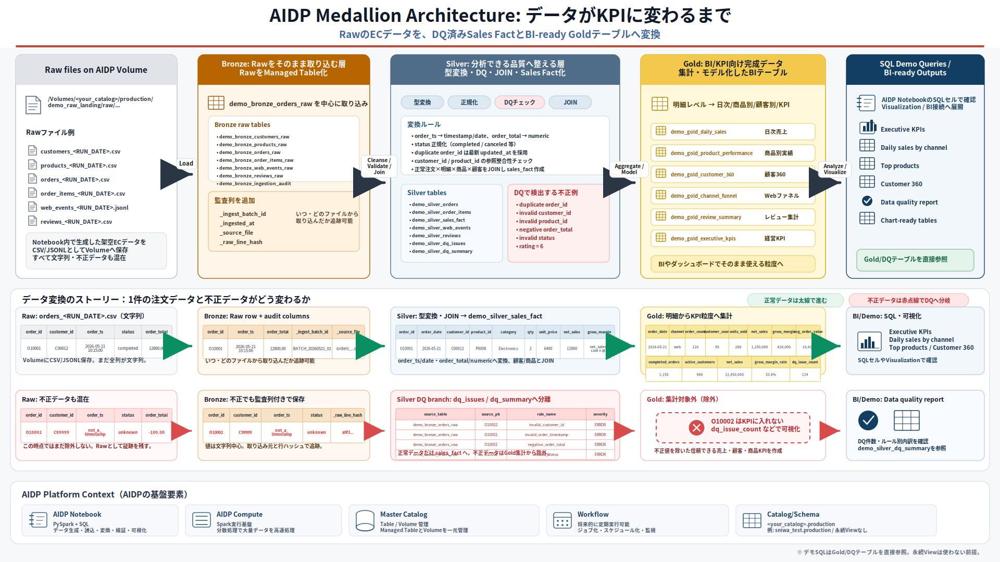

# AIDP Medallion Demo - copy/paste cells

AIDP上でNotebook/Catalog/Schemaがまだ無い状態から始める場合は、以下のMarkdownセルとPython/SQLセルを順番に貼り付けて実行してください。

## Cell 00 - Markdown

# AIDP Medallion Architecture Demo for `<your_catalog>.production`

このノートブックは、AIDP Workbench上で **Raw files -> Bronze -> Silver -> Gold** の流れを体感するためのデモです。

既存のNotebook、Catalog、Schemaがない状態から始める前提で使えます。AIDP UIで必要な入れ物を作成したあと、このNotebookを実行してください。

このデモで使う名前:

- Workspace folder: `/Shared/odisv/<your_name>` （`<your_name>` は各自の名前に置き換え）
- Notebook: `aidp_medallion_demo.ipynb`
- Catalog: `<your_catalog>` （各自の名前のCatalog名。例: `sniwa_test`）
- Schema: `production`
- Namespace: `<your_catalog>.production` （例: `sniwa_test.production`）
- Raw Volume: `demo_raw_landing`
- Artifact Volume: `demo_artifacts`

RawファイルはVolumeへ作成し、Bronze/Silver/Goldは `<your_catalog>.production.demo_*` のManaged Tableとして作成します。`<your_catalog>` は各自の名前のCatalog名に置き換えます。例として `sniwa_test.production.demo_*` を使えます。

## このNotebookだけで完結するデモです

このNotebookでは、外部のCSVや実データを事前に用意する必要はありません。架空のEC/小売データをNotebook内で生成し、AIDP Managed VolumeにRawファイルとして書き出し、そのRawファイルをBronze/Silver/Goldへ段階的に加工します。

扱う業務シナリオは、架空オンラインショップの購買・行動・レビュー分析です。最終的には、売上KPI、商品別実績、顧客360、Webファネル、レビュー集計、経営KPIを確認します。

## データ変換イメージ



この図は、RawのECデータがBronzeで監査列付きのRawテーブルになり、Silverで型変換・DQ分離・JOINを経て、GoldでBI向けKPIへ集計される流れを示しています。AIDPへNotebookをインポートする場合は、このSVGファイルもNotebookと同じWorkspaceフォルダにアップロードしてください。

## 利用するRawファイル

| Raw file | Format | 主なカラム | 役割 |
|---|---|---|---|
| `customers_<RUN_DATE>.csv` | CSV | `customer_id`, `customer_name`, `email`, `prefecture`, `customer_segment`, `signup_date`, `birth_year` | 顧客マスタ。Silver顧客ディメンションとGold顧客360の基礎データ |
| `products_<RUN_DATE>.csv` | CSV | `product_id`, `category`, `sub_category`, `brand`, `product_name`, `list_price`, `cost`, `active_flag` | 商品マスタ。売上ファクト、商品別実績、レビュー集計に利用 |
| `orders_<RUN_DATE>.csv` | CSV | `order_id`, `customer_id`, `order_ts`, `channel`, `status`, `payment_method`, `coupon_code`, `order_total`, `updated_at` | 注文ヘッダ。注文日時、チャネル、ステータス、支払方法を管理 |
| `order_items_<RUN_DATE>.csv` | CSV | `order_id`, `line_no`, `product_id`, `quantity`, `unit_price`, `discount_amount` | 注文明細。商品別数量、単価、値引きから売上・粗利を計算 |
| `web_events_<RUN_DATE>.jsonl` | JSONL | `event_id`, `session_id`, `customer_id`, `event_ts`, `event_type`, `product_id`, `campaign_id`, `device`, `referrer` | Web行動ログ。閲覧、商品閲覧、カート追加、購入イベントからファネルを作成 |
| `reviews_<RUN_DATE>.csv` | CSV | `review_id`, `customer_id`, `product_id`, `review_ts`, `rating`, `review_text` | 商品レビュー。ratingとテキストからレビュー集計、簡易sentiment分類を作成 |

Rawファイルは次のようなVolume配下に作成されます。

```text
/Volumes/<your_catalog>/production/demo_raw_landing/raw/customers/
/Volumes/<your_catalog>/production/demo_raw_landing/raw/products/
/Volumes/<your_catalog>/production/demo_raw_landing/raw/orders/
/Volumes/<your_catalog>/production/demo_raw_landing/raw/order_items/
/Volumes/<your_catalog>/production/demo_raw_landing/raw/web_events/
/Volumes/<your_catalog>/production/demo_raw_landing/raw/reviews/
```

## 意図的に混ぜるデータ品質問題

Medallion Architectureの価値が見えるように、Rawには少量の不正データを混ぜます。

| 種類 | 例 | Silverでの扱い |
|---|---|---|
| 重複注文 | 同じ `order_id` が複数行 | 最新の `updated_at` を採用 |
| 存在しない顧客 | `customer_id = C99999` | DQ issueとして記録し、有効注文から除外 |
| 存在しない商品 | `product_id = P99999` | DQ issueとして記録し、有効明細から除外 |
| 不正な金額 | `order_total = -100.00` | DQ issueとして記録し、有効注文から除外 |
| 不正な数量 | `quantity = 0` | DQ issueとして記録し、有効明細から除外 |
| 不正な日時 | `order_ts = not_a_timestamp` / `event_ts = bad_ts` | DQ issueとして記録し、有効データから除外 |
| 不正なステータス | `status = unknown` | DQ issueとして記録し、有効注文から除外 |
| 不正なイベント | `event_type = teleport` | DQ issueとして記録し、有効Webイベントから除外 |
| 不正なレビュー評価 | `rating = 6` | DQ issueとして記録し、有効レビューから除外 |

## 加工の流れ

| Layer | 作成するもの | この層で行うこと | 確認するポイント |
|---|---|---|---|
| Raw | Volume上のCSV/JSONL | Notebook内で合成したデータをファイルとして保存 | ファイル一覧、サイズ、Rawサンプル |
| Bronze | `demo_bronze_*_raw`, `demo_bronze_ingestion_audit` | RawをなるべくそのままManaged Table化し、監査列を付与 | 件数、取込監査、`_source_file`, `_raw_line_hash` |
| Silver | `demo_silver_*`, `demo_silver_sales_fact`, `demo_silver_dq_*` | 型変換、重複排除、参照整合性チェック、不正データ分離、売上ファクト作成 | Silver件数、型変換後のスキーマ、DQサマリ/明細 |
| Gold | `demo_gold_*` | BI/業務向けに集計済みテーブルを作成 | 日次売上、商品実績、顧客360、ファネル、レビュー、経営KPI |
| Temp Views/Queries | `demo_vw_*`, SQL確認セル | SQLで見せやすい一時Viewと確認クエリを作成 | Python抽出とSQL抽出の一致、デモ用SQL結果 |

## 最終的に見るGoldアウトプット

| Gold table | 内容 |
|---|---|
| `demo_gold_daily_sales` | 日次・チャネル別の注文数、顧客数、数量、売上、粗利、平均注文額 |
| `demo_gold_product_performance` | 商品別の販売数量、売上、粗利、レビュー件数、平均rating |
| `demo_gold_customer_360` | 顧客別の購入回数、LTV、粗利、初回/最終購入日、好みカテゴリ |
| `demo_gold_channel_funnel` | device/referrer別のセッション、閲覧、商品閲覧、カート追加、購入ファネル |
| `demo_gold_review_summary` | 商品別レビュー数、平均rating、positive/neutral/negative件数 |
| `demo_gold_executive_kpis` | 経営者向けの1行KPIサマリ |

## Notebookの読み方

各Python/SQL実行セルの直前に、そのセルで何をするかをMarkdownで説明しています。まずMarkdownを読んで目的を確認し、次の実行セルを実行してください。

全体の流れは次の通りです。

1. AIDP UIでWorkspace、Notebook、Catalog、Schema、Volumeを作る
2. 実行設定と共通関数を準備する
3. 架空ECデータを作り、RawファイルとしてVolumeへ置く
4. RawをBronzeテーブルに取り込む
5. Silverで型変換、重複排除、参照整合性チェック、DQ検出を行う
6. GoldでBI/KPI向けの集計テーブルを作る
7. 一時View、確認SQL、任意の可視化、Artifact出力を確認する

## Cell 01 - Markdown

## Step 00 - Create AIDP Assets From Scratch

このNotebookは、次のアセットがまだ存在しない前提で始められるようにしています。

- Workspace notebook: `/Shared/odisv/<your_name>/aidp_medallion_demo.ipynb`
- Catalog: `<your_catalog>` （各自の名前のCatalog名。例: `sniwa_test`）
- Schema: `production`
- Namespace: `<your_catalog>.production` （例: `sniwa_test.production`）

AIDP UIで先に作成するもの:

1. Workbench/Workspaceを開く、または新規作成する
2. Workspace内の `/Shared/odisv/` 配下に、各自の名前のフォルダを作成する。例: `/Shared/odisv/sniwa`
3. その個人フォルダ配下に `aidp_medallion_demo.ipynb` というNotebookを新規作成する、またはこの `aidp_medallion_demo_cells.ipynb` をインポートする
4. NotebookにSpark Computeをアタッチする
5. Master Catalogで各自のCatalogを作成する。例: `sniwa_test`
6. そのCatalogの中にSchema `production` を作成する
7. Schema `production` の中にManaged Volume `demo_raw_landing` と `demo_artifacts` を作成する

権限が足りない場合は、Catalog/Schema/Volumeの作成権限を管理者に付与してもらってください。

Catalog名は各自の名前に合わせて作成します。次の `Step 01 - Demo Configuration` の `CATALOG` を、AIDP UIで作成したCatalog名に変更してください。例では `sniwa_test.production` を使います。SQLセルはPython側で設定した現在のCatalog/Schemaを使うため、Catalog名を変えた場合も上から順番に実行すれば同じSQLセルが使えます。

## Cell 02 - Markdown

## Step 01 - Demo Configuration

このセルでは、デモ全体で使う名前と実行条件を定義します。

ここで決めた `CATALOG`、`SCHEMA`、Volume名が、以降のテーブル名とファイルパスの基準になります。AIDP UIで一から作成した名前と一致していることを確認してください。Catalog名を変更したい場合は、基本的にこのセルの `CATALOG` を変更し、AIDP UI側でも同じCatalog名でSchema/Volumeを作成します。

確認ポイント:

- `CATALOG` が各自のCatalog名になっていること。例: `CATALOG = "sniwa_test"`
- `SCHEMA = "production"`
- Raw Volume は `demo_raw_landing`
- Artifact Volume は `demo_artifacts`
- `BASE_RAW_PATH` が `/Volumes/<CATALOG>/production/demo_raw_landing/raw` の形になっていること

## Cell 03 - Python

```python
# ============================================================
# 00. Demo configuration
# ============================================================
# AIDP UIで作成したCatalog/Schema/Volume名に合わせます。
# CATALOGは各自の名前のCatalog名に変更してください。例: "sniwa_test"

CATALOG = "sniwa_test"
SCHEMA = "production"

RAW_VOLUME = "demo_raw_landing"
ARTIFACT_VOLUME = "demo_artifacts"

TABLE_PREFIX = "demo"
RUN_DATE = "2026-05-21"

# Trueにすると、demo_*テーブルを削除してから作り直します。
# 再実行時に既存のdemo_*テーブルを残したい場合はFalseにしてください。
RESET_DEMO = True

# わざと不正データを混ぜて、Silver層のDQ処理を見せます。
INCLUDE_DIRTY_DATA = True

# デモ規模。大きくしすぎるとNotebook実行が長くなります。
CUSTOMER_COUNT = 200
PRODUCT_COUNT = 60
ORDER_COUNT = 1000
WEB_EVENT_COUNT = 5000
REVIEW_COUNT = 300
RANDOM_SEED = 42

# AIDPのVolume POSIXパス
BASE_RAW_PATH = f"/Volumes/{CATALOG}/{SCHEMA}/{RAW_VOLUME}/raw"
BASE_ARTIFACT_PATH = f"/Volumes/{CATALOG}/{SCHEMA}/{ARTIFACT_VOLUME}"

# Sparkの小規模デモ向け設定
spark.conf.set("spark.sql.shuffle.partitions", "8")

print("AIDP Medallion Demo configuration")
print(f"  catalog          = {CATALOG}")
print(f"  schema           = {SCHEMA}")
print(f"  raw volume       = {RAW_VOLUME}")
print(f"  artifact volume  = {ARTIFACT_VOLUME}")
print(f"  base raw path    = {BASE_RAW_PATH}")
print(f"  run date         = {RUN_DATE}")
print(f"  reset demo       = {RESET_DEMO}")
print(f"  dirty data       = {INCLUDE_DIRTY_DATA}")
```

## Cell 04 - Markdown

## Step 02 - Common Helpers

このセルでは、以降の処理で繰り返し使う共通関数を準備します。

主な役割は、完全修飾テーブル名の生成、SQL実行、SQLセル用のCatalog/Schema設定、Raw CSVの読み込み、Bronze監査列の付与、Deltaテーブルへの保存、DQ issueの共通形式作成です。

確認ポイント:

- `Batch ID` が表示されること
- 後続のSQLセルが参照するCatalog/Schemaは、Bootstrap時に `CATALOG` / `SCHEMA` から設定されること
- `demo_bronze_*`、`demo_silver_*`、`demo_gold_*` のテーブル一覧が定義されていること

## Cell 05 - Python

```python
# ============================================================
# 01. Common imports and helper functions
# ============================================================

import os
import csv
import json
import uuid
import shutil
import random
from pathlib import Path
from datetime import datetime, timedelta
from functools import reduce

from pyspark.sql import functions as F
from pyspark.sql.window import Window

BATCH_ID = f"batch_{RUN_DATE.replace('-', '')}_{uuid.uuid4().hex[:8]}"

BRONZE_TABLES = [
    "demo_bronze_customers_raw",
    "demo_bronze_products_raw",
    "demo_bronze_orders_raw",
    "demo_bronze_order_items_raw",
    "demo_bronze_web_events_raw",
    "demo_bronze_reviews_raw",
    "demo_bronze_ingestion_audit",
]

SILVER_TABLES = [
    "demo_silver_customers",
    "demo_silver_products",
    "demo_silver_orders",
    "demo_silver_order_items",
    "demo_silver_sales_fact",
    "demo_silver_web_events",
    "demo_silver_reviews",
    "demo_silver_dq_issues",
    "demo_silver_dq_summary",
]

GOLD_TABLES = [
    "demo_gold_daily_sales",
    "demo_gold_product_performance",
    "demo_gold_customer_360",
    "demo_gold_channel_funnel",
    "demo_gold_review_summary",
    "demo_gold_executive_kpis",
]

ALL_TABLES = BRONZE_TABLES + SILVER_TABLES + GOLD_TABLES


def fq(name: str) -> str:
    """Fully qualified name for DataFrame APIs."""
    return f"{CATALOG}.{SCHEMA}.{name}"


def qident(*parts: str) -> str:
    """Backtick-quoted identifier for SQL text."""
    return ".".join(f"`{p}`" for p in parts)


def qfq(name: str) -> str:
    return qident(CATALOG, SCHEMA, name)


def volume_root(volume_name: str) -> str:
    return f"/Volumes/{CATALOG}/{SCHEMA}/{volume_name}"


def safe_sql(sql_text: str, soft_fail: bool = True):
    """Run SQL. If soft_fail=True, print warning and continue on failure."""
    try:
        return spark.sql(sql_text)
    except Exception as e:
        if soft_fail:
            print("[WARN] SQL failed but continuing:")
            print(sql_text)
            print(str(e)[:2000])
            return None
        raise


def show_df(df, n: int = 20, truncate: bool = False):
    """Use AIDP display() if available; otherwise fall back to Spark show()."""
    try:
        display(df.limit(n))
    except Exception:
        df.show(n, truncate=truncate)


def read_raw_csv(path: str):
    return (
        spark.read
        .option("header", True)
        .option("inferSchema", False)
        .option("mode", "PERMISSIVE")
        .option("quote", '"')
        .option("escape", '"')
        .csv(path)
    )


def add_bronze_metadata(df, source_name: str):
    """Add common Bronze audit columns."""
    raw_cols = df.columns
    row_hash = F.sha2(
        F.concat_ws("||", *[F.coalesce(F.col(c).cast("string"), F.lit("")) for c in raw_cols]),
        256,
    )
    return (
        df
        .withColumn("_ingest_batch_id", F.lit(BATCH_ID))
        .withColumn("_ingested_at", F.current_timestamp())
        .withColumn("_source_file", F.input_file_name())
        .withColumn("_source_name", F.lit(source_name))
        .withColumn("_raw_line_hash", row_hash)
    )


def write_delta_table(df, table_name: str, mode: str = "overwrite"):
    """Write a managed Delta table under the configured catalog/schema."""
    (
        df.write
        .format("delta")
        .mode(mode)
        .option("overwriteSchema", "true")
        .saveAsTable(fq(table_name))
    )
    row_count = spark.table(fq(table_name)).count()
    print(f"[OK] {fq(table_name)} : {row_count:,} rows")


def dq_issue(df, source_table: str, pk_col: str, condition, rule_name: str, detail_col=None, severity: str = "ERROR"):
    """Create a DQ issue dataframe with a common schema."""
    if detail_col is None:
        detail_col = F.lit(rule_name)
    return (
        df.filter(condition)
        .select(
            F.expr("uuid()").alias("issue_id"),
            F.lit(source_table).alias("source_table"),
            F.col(pk_col).cast("string").alias("source_pk"),
            F.lit(rule_name).alias("rule_name"),
            F.lit(severity).alias("severity"),
            detail_col.cast("string").alias("issue_detail"),
            F.lit(BATCH_ID).alias("_ingest_batch_id"),
            F.current_timestamp().alias("detected_at"),
        )
    )


def write_csv_file(path: str, rows: list[dict], fieldnames: list[str]):
    Path(path).parent.mkdir(parents=True, exist_ok=True)
    with open(path, "w", newline="", encoding="utf-8") as f:
        writer = csv.DictWriter(f, fieldnames=fieldnames)
        writer.writeheader()
        writer.writerows(rows)


def write_jsonl_file(path: str, rows: list[dict]):
    Path(path).parent.mkdir(parents=True, exist_ok=True)
    with open(path, "w", encoding="utf-8") as f:
        for row in rows:
            f.write(json.dumps(row, ensure_ascii=False) + "\n")

def set_sql_namespace():
    """Set current Catalog/Schema so later %sql cells can use unqualified demo_* names."""
    # AIDPでは `USE catalog.schema` が通る環境があるため、こちらを先に試します。
    try:
        spark.sql(f"USE {qident(CATALOG, SCHEMA)}")
        print(f"[OK] SQL namespace set to {CATALOG}.{SCHEMA}")
        return
    except Exception as first_error:
        print("[INFO] USE catalog.schema failed; trying USE CATALOG / USE SCHEMA instead.")
        print(str(first_error)[:1000])

    spark.sql(f"USE CATALOG {qident(CATALOG)}")
    spark.sql(f"USE SCHEMA {qident(SCHEMA)}")
    print(f"[OK] SQL namespace set to {CATALOG}.{SCHEMA}")


print(f"Batch ID: {BATCH_ID}")
```

## Cell 06 - Markdown

## Step 03 - Create Catalog, Schema, and Managed Volumes

このデモでは、Catalog/Schema/Tableで加工結果を管理し、Managed VolumeでRawファイルと成果物CSVを管理します。

Notebookから `CREATE VOLUME` やCatalog作成を実行できない環境があるため、ここではAIDP UIから作成する前提にしています。

AIDP UIで作成するもの:

| Asset | Name | 用途 |
|---|---|---|
| Catalog | `<your_catalog>` | 各自の名前のCatalog名。例: `sniwa_test` |
| Schema | `production` | Bronze/Silver/GoldテーブルとVolumeの配置先 |
| Managed Volume | `demo_raw_landing` | Raw CSV/JSONLファイル置き場 |
| Managed Volume | `demo_artifacts` | Gold出力CSVやデモ成果物置き場 |

作成手順の目安:

1. `Master catalog` を開く
2. 各自のCatalogを作成する。例: `sniwa_test`
3. そのCatalogを開き、Schema `production` を作成する
4. Schema `production` を開き、`Volumes` を開く
5. `Create volume` をクリックする
6. Volume Type で `Managed` を選ぶ
7. `demo_raw_landing` と `demo_artifacts` を作成する

作成後、次の `Step 04 - Bootstrap Checks and Cleanup` の説明を読み、その直後のPythonセルを実行してください。VolumeのPOSIXパス `/Volumes/<CATALOG>/production/...` が見つかるかをチェックします。

## Cell 07 - Markdown

## Step 04 - Bootstrap Checks and Cleanup

このセルでは、Step 03でAIDP UIから作成したCatalog/Schema/VolumeがNotebookから見えるかを確認します。

`RESET_DEMO = True` の場合は、既存の `demo_*` Tableを削除してから作り直せる状態にします。Catalog、Schema、Volumeの作成DDLはここでは実行しません。一時ViewはNotebookセッション内のものなので、ここでは削除対象にしません。

確認ポイント:

- `Bootstrap completed` と表示されること
- Raw path と Artifact path が `/Volumes/<CATALOG>/production/...` で表示されること
- `SQL namespace set to <CATALOG>.production` と表示されること
- パスが見つからない場合は、AIDP UIでCatalog/Schema/Managed Volumeを作成してから再実行すること

## Cell 08 - Python

```python
# ============================================================
# 02. Bootstrap checks and cleanup
# ============================================================
# Catalog/Schema/Managed VolumeはStep 03でAIDP UIから作成した前提です。
# このセルでは作成DDLは実行せず、パスの存在確認とdemo_*資産の初期化だけを行います。

# 後続のSQLセルが未修飾のdemo_*名で動くように、現在のCatalog/Schemaを設定します。
set_sql_namespace()

# demo_* Tableを作り直す
if RESET_DEMO:
    print("RESET_DEMO=True: dropping existing demo tables...")
    for table_name in reversed(ALL_TABLES):
        safe_sql(f"DROP TABLE IF EXISTS {qfq(table_name)}", soft_fail=True)

# Volumeパスの存在確認
missing_volume_paths = []
for root in [volume_root(RAW_VOLUME), volume_root(ARTIFACT_VOLUME)]:
    if not os.path.exists(root):
        missing_volume_paths.append(root)

if missing_volume_paths:
    raise FileNotFoundError(
        "AIDP Volume path was not found. Create Catalog, Schema, and Managed Volumes from UI first, then rerun this cell.\n"
        + "Missing paths:\n  - " + "\n  - ".join(missing_volume_paths) + "\n\n"
        + f"UI path: Master catalog > {CATALOG} > {SCHEMA} > Volumes > Create volume > Managed"
    )

Path(BASE_RAW_PATH).mkdir(parents=True, exist_ok=True)
Path(BASE_ARTIFACT_PATH).mkdir(parents=True, exist_ok=True)

print("[OK] Bootstrap completed")
print(f"Raw path      : {BASE_RAW_PATH}")
print(f"Artifact path : {BASE_ARTIFACT_PATH}")
```

## Cell 09 - Markdown

## Step 05 - Generate Synthetic EC Dataset

このセルでは、架空のEC/小売データをPythonのリストとして生成します。

顧客、商品、注文、注文明細、Webイベント、レビューを作ります。Medallion Architectureの価値が見えるように、重複注文、不正な顧客ID、負の金額、不正日時、不正ratingなども少量混ぜます。

確認ポイント:

- customers/products/orders/order_items/web_events/reviews の件数が表示されること
- `INCLUDE_DIRTY_DATA = True` の場合、不正データが後続のSilver DQで検出されること

## Cell 10 - Python

```python
# ============================================================
# 03. Generate synthetic EC dataset
# ============================================================
# ここではPythonだけでダミーデータを作ります。
# 実業務の取り込みに置き換える場合、このセルをObject StorageやDBからのreadに差し替えます。

random.seed(RANDOM_SEED)
base_dt = datetime.strptime(RUN_DATE, "%Y-%m-%d")

prefectures = [
    "Tokyo", "Kanagawa", "Chiba", "Saitama", "Osaka", "Kyoto", "Hyogo",
    "Aichi", "Fukuoka", "Hokkaido", "Miyagi", "Hiroshima",
]
segments = ["new", "regular", "vip"]
channels = ["web", "mobile", "store", "call_center"]
payment_methods = ["credit_card", "bank_transfer", "paypay", "cash_on_delivery"]

category_map = {
    "Electronics": ["Laptop", "Tablet", "Accessory", "Camera"],
    "Home": ["Kitchen", "Storage", "Cleaning", "Furniture"],
    "Beauty": ["Skincare", "Haircare", "Makeup"],
    "Sports": ["Outdoor", "Fitness", "Running"],
    "Books": ["Business", "Tech", "Novel"],
}
brands = ["Aster", "Belltree", "Cielo", "Delta", "Eastline", "Fabrik", "Greenon"]

# Customers
customers = []
for i in range(1, CUSTOMER_COUNT + 1):
    cid = f"C{i:05d}"
    signup_dt = base_dt - timedelta(days=random.randint(1, 900))
    customers.append({
        "customer_id": cid,
        "customer_name": f"Demo Customer {i:05d}",
        "email": f"customer{i:05d}@example.com",
        "prefecture": random.choice(prefectures),
        "customer_segment": random.choices(segments, weights=[0.25, 0.60, 0.15])[0],
        "signup_date": signup_dt.strftime("%Y-%m-%d"),
        "birth_year": str(random.randint(1955, 2005)),
    })

# Products
products = []
cat_sub_pairs = [(c, s) for c, subs in category_map.items() for s in subs]
for i in range(1, PRODUCT_COUNT + 1):
    pid = f"P{i:05d}"
    category, sub_category = random.choice(cat_sub_pairs)
    price = round(random.choice([980, 1480, 1980, 2980, 4980, 7980, 12800, 24800, 49800]) * random.uniform(0.90, 1.15), 2)
    cost = round(price * random.uniform(0.45, 0.78), 2)
    products.append({
        "product_id": pid,
        "category": category,
        "sub_category": sub_category,
        "brand": random.choice(brands),
        "product_name": f"{category} {sub_category} Item {i:03d}",
        "list_price": f"{price:.2f}",
        "cost": f"{cost:.2f}",
        "active_flag": random.choices(["Y", "N"], weights=[0.94, 0.06])[0],
    })

# Orders and order items
orders = []
order_items = []
for i in range(1, ORDER_COUNT + 1):
    order_id = f"O{i:06d}"
    customer = random.choice(customers)
    order_dt = base_dt - timedelta(days=random.randint(0, 13), minutes=random.randint(0, 1439))
    updated_dt = order_dt + timedelta(minutes=random.randint(1, 180))
    status = random.choices(["completed", "cancelled", "refunded", "pending"], weights=[0.82, 0.08, 0.05, 0.05])[0]
    channel = random.choices(channels, weights=[0.46, 0.34, 0.14, 0.06])[0]
    payment = random.choice(payment_methods)
    coupon = random.choice(["", "WELCOME10", "SPRING5", "VIP15", "FREESHIP"])

    n_items = random.randint(1, 5)
    order_total = 0.0
    for line_no in range(1, n_items + 1):
        product = random.choice(products)
        quantity = random.choice([1, 1, 1, 2, 2, 3, 4])
        unit_price = round(float(product["list_price"]) * random.uniform(0.82, 1.00), 2)
        discount_amount = round(unit_price * quantity * random.choice([0, 0, 0, 0.05, 0.10, 0.15]), 2)
        line_net = quantity * unit_price - discount_amount
        order_total += line_net
        order_items.append({
            "order_id": order_id,
            "line_no": str(line_no),
            "product_id": product["product_id"],
            "quantity": str(quantity),
            "unit_price": f"{unit_price:.2f}",
            "discount_amount": f"{discount_amount:.2f}",
        })

    orders.append({
        "order_id": order_id,
        "customer_id": customer["customer_id"],
        "order_ts": order_dt.strftime("%Y-%m-%d %H:%M:%S"),
        "channel": channel,
        "status": status,
        "payment_method": payment,
        "coupon_code": coupon,
        "order_total": f"{order_total:.2f}",
        "updated_at": updated_dt.strftime("%Y-%m-%d %H:%M:%S"),
    })

# Web events
web_events = []
event_types = ["view", "search", "product_view", "add_to_cart", "purchase"]
devices = ["pc", "ios", "android"]
referrers = ["direct", "search", "email", "social", "ad"]
for i in range(1, WEB_EVENT_COUNT + 1):
    session_id = f"S{random.randint(1, 1800):06d}"
    event_dt = base_dt - timedelta(days=random.randint(0, 13), minutes=random.randint(0, 1439), seconds=random.randint(0, 59))
    maybe_customer = random.choice(customers)["customer_id"] if random.random() < 0.72 else ""
    maybe_product = random.choice(products)["product_id"] if random.random() < 0.65 else ""
    event_type = random.choices(event_types, weights=[0.45, 0.16, 0.24, 0.10, 0.05])[0]
    web_events.append({
        "event_id": f"E{i:07d}",
        "session_id": session_id,
        "customer_id": maybe_customer,
        "event_ts": event_dt.strftime("%Y-%m-%d %H:%M:%S"),
        "event_type": event_type,
        "product_id": maybe_product,
        "campaign_id": random.choice(["", "CMP_SPRING", "CMP_RETARGET", "CMP_VIP"]),
        "device": random.choice(devices),
        "referrer": random.choice(referrers),
    })

# Reviews
positive_texts = [
    "Great quality and fast delivery.",
    "Very useful. I would buy it again.",
    "Good value for money.",
]
neutral_texts = [
    "It is okay, nothing special.",
    "Average product for daily use.",
    "Packaging was fine but delivery was slow.",
]
negative_texts = [
    "Quality was below expectation.",
    "I had trouble using this item.",
    "Not worth the price.",
]
reviews = []
for i in range(1, REVIEW_COUNT + 1):
    rating = random.choices([1, 2, 3, 4, 5], weights=[0.06, 0.10, 0.22, 0.34, 0.28])[0]
    if rating >= 4:
        text = random.choice(positive_texts)
    elif rating == 3:
        text = random.choice(neutral_texts)
    else:
        text = random.choice(negative_texts)
    review_dt = base_dt - timedelta(days=random.randint(0, 13), minutes=random.randint(0, 1439))
    reviews.append({
        "review_id": f"R{i:06d}",
        "customer_id": random.choice(customers)["customer_id"],
        "product_id": random.choice(products)["product_id"],
        "review_ts": review_dt.strftime("%Y-%m-%d %H:%M:%S"),
        "rating": str(rating),
        "review_text": text,
    })

# Inject intentionally dirty data
if INCLUDE_DIRTY_DATA:
    # duplicate order_id: latest updated_at should win in Silver
    duplicate_order = dict(orders[0])
    duplicate_order["status"] = "refunded"
    duplicate_order["updated_at"] = (base_dt + timedelta(hours=2)).strftime("%Y-%m-%d %H:%M:%S")
    orders.append(duplicate_order)

    # invalid customer, invalid amount, invalid timestamp, invalid status
    bad1 = dict(orders[1])
    bad1["order_id"] = "O_BAD_CUSTOMER"
    bad1["customer_id"] = "C99999"
    orders.append(bad1)

    bad2 = dict(orders[2])
    bad2["order_id"] = "O_BAD_AMOUNT"
    bad2["order_total"] = "-100.00"
    orders.append(bad2)

    bad3 = dict(orders[3])
    bad3["order_id"] = "O_BAD_TS"
    bad3["order_ts"] = "not_a_timestamp"
    orders.append(bad3)

    bad4 = dict(orders[4])
    bad4["order_id"] = "O_BAD_STATUS"
    bad4["status"] = "unknown"
    orders.append(bad4)

    # invalid order items
    order_items.append({
        "order_id": orders[5]["order_id"],
        "line_no": "99",
        "product_id": "P99999",
        "quantity": "1",
        "unit_price": "1000.00",
        "discount_amount": "0.00",
    })
    order_items.append({
        "order_id": orders[6]["order_id"],
        "line_no": "99",
        "product_id": products[0]["product_id"],
        "quantity": "0",
        "unit_price": "1000.00",
        "discount_amount": "0.00",
    })
    order_items.append({
        "order_id": "O_NOT_EXISTS",
        "line_no": "1",
        "product_id": products[1]["product_id"],
        "quantity": "1",
        "unit_price": "1000.00",
        "discount_amount": "0.00",
    })

    # invalid web event and invalid review
    web_events.append({
        "event_id": "E_BAD_TS",
        "session_id": "S_BAD",
        "customer_id": customers[0]["customer_id"],
        "event_ts": "bad_ts",
        "event_type": "teleport",
        "product_id": products[0]["product_id"],
        "campaign_id": "CMP_BAD",
        "device": "pc",
        "referrer": "direct",
    })
    reviews.append({
        "review_id": "R_BAD_RATING",
        "customer_id": customers[0]["customer_id"],
        "product_id": products[0]["product_id"],
        "review_ts": base_dt.strftime("%Y-%m-%d %H:%M:%S"),
        "rating": "6",
        "review_text": "Rating is intentionally invalid.",
    })

print("Generated in-memory raw data")
print(f"  customers   : {len(customers):,}")
print(f"  products    : {len(products):,}")
print(f"  orders      : {len(orders):,}")
print(f"  order_items : {len(order_items):,}")
print(f"  web_events  : {len(web_events):,}")
print(f"  reviews     : {len(reviews):,}")
```

## Cell 11 - Markdown

## Step 06 - Write Raw Files to Volume

このセルでは、生成した架空データをAIDP Volume上のRawファイルとして保存します。

CSVとJSONLを `BASE_RAW_PATH`、つまり `/Volumes/<your_catalog>/production/demo_raw_landing/raw/...` 配下に書き出します。このRawファイルがBronzeロードの入力になります。

確認ポイント:

- `Raw files written` と表示されること
- customers/products/orders/order_items/reviews はCSV、web_events はJSONLとして出力されること

## Cell 12 - Python

```python
# ============================================================
# 04. Write raw files to AIDP Volume
# ============================================================
# RawファイルをVolume配下に配置します。
# これがBronzeロードの入力になります。

raw_root = Path(BASE_RAW_PATH)

if RESET_DEMO and raw_root.exists():
    print(f"Removing previous raw files: {raw_root}")
    shutil.rmtree(str(raw_root))

# File paths
paths = {
    "customers": f"{BASE_RAW_PATH}/customers/customers_{RUN_DATE}.csv",
    "products": f"{BASE_RAW_PATH}/products/products_{RUN_DATE}.csv",
    "orders": f"{BASE_RAW_PATH}/orders/orders_{RUN_DATE}.csv",
    "order_items": f"{BASE_RAW_PATH}/order_items/order_items_{RUN_DATE}.csv",
    "web_events": f"{BASE_RAW_PATH}/web_events/web_events_{RUN_DATE}.jsonl",
    "reviews": f"{BASE_RAW_PATH}/reviews/reviews_{RUN_DATE}.csv",
}

write_csv_file(paths["customers"], customers, [
    "customer_id", "customer_name", "email", "prefecture", "customer_segment", "signup_date", "birth_year"
])
write_csv_file(paths["products"], products, [
    "product_id", "category", "sub_category", "brand", "product_name", "list_price", "cost", "active_flag"
])
write_csv_file(paths["orders"], orders, [
    "order_id", "customer_id", "order_ts", "channel", "status", "payment_method", "coupon_code", "order_total", "updated_at"
])
write_csv_file(paths["order_items"], order_items, [
    "order_id", "line_no", "product_id", "quantity", "unit_price", "discount_amount"
])
write_jsonl_file(paths["web_events"], web_events)
write_csv_file(paths["reviews"], reviews, [
    "review_id", "customer_id", "product_id", "review_ts", "rating", "review_text"
])

print("[OK] Raw files written")
for k, p in paths.items():
    print(f"  {k:12s} {p}")
```

## Cell 13 - Markdown

## Step 07 - Inspect Raw Files

このセルでは、Volumeに作成されたRawファイルを確認します。

ファイル一覧、サイズ、CSV/JSONLのサンプルを表示します。ここは「AIDP VolumeにRawが置かれている」ことをデモで見せるポイントです。

確認ポイント:

- Raw配下に6種類のファイルが見えること
- customersとweb_eventsのサンプルが表示されること

## Cell 14 - Python

```python
# ============================================================
# 05. Inspect raw files
# ============================================================
# Volumeに置かれたファイルを確認します。

file_rows = []
for root, dirs, files in os.walk(BASE_RAW_PATH):
    for name in files:
        full_path = os.path.join(root, name)
        file_rows.append((full_path, os.path.getsize(full_path)))

file_df = spark.createDataFrame(file_rows, "path string, size_bytes long")
show_df(file_df.orderBy("path"), 50)

print("Customers sample from raw CSV:")
show_df(read_raw_csv(f"{BASE_RAW_PATH}/customers/*.csv"), 5)

print("Web events sample from raw JSONL:")
show_df(spark.read.json(f"{BASE_RAW_PATH}/web_events/*.jsonl"), 5)
```

## Cell 15 - Markdown

## Step 08 - Load Bronze Tables

このセルでは、RawファイルをBronzeテーブルに取り込みます。

BronzeはRawをなるべくそのまま保持する層です。各行に `_ingest_batch_id`、`_ingested_at`、`_source_file`、`_source_name`、`_raw_line_hash` を付与し、再処理や監査に使える形にします。

確認ポイント:

- `demo_bronze_*_raw` テーブルが作成されること
- `demo_bronze_ingestion_audit` にソース別の取り込み件数が入ること

## Cell 16 - Python

```python
# ============================================================
# 06. Load Bronze tables
# ============================================================
# BronzeではRawデータをなるべくそのまま取り込み、監査列を付与します。

bronze_customers = add_bronze_metadata(
    read_raw_csv(f"{BASE_RAW_PATH}/customers/*.csv"),
    "customers",
)
bronze_products = add_bronze_metadata(
    read_raw_csv(f"{BASE_RAW_PATH}/products/*.csv"),
    "products",
)
bronze_orders = add_bronze_metadata(
    read_raw_csv(f"{BASE_RAW_PATH}/orders/*.csv"),
    "orders",
)
bronze_order_items = add_bronze_metadata(
    read_raw_csv(f"{BASE_RAW_PATH}/order_items/*.csv"),
    "order_items",
)
bronze_web_events = add_bronze_metadata(
    spark.read.option("mode", "PERMISSIVE").json(f"{BASE_RAW_PATH}/web_events/*.jsonl"),
    "web_events",
)
bronze_reviews = add_bronze_metadata(
    read_raw_csv(f"{BASE_RAW_PATH}/reviews/*.csv"),
    "reviews",
)

write_delta_table(bronze_customers, "demo_bronze_customers_raw")
write_delta_table(bronze_products, "demo_bronze_products_raw")
write_delta_table(bronze_orders, "demo_bronze_orders_raw")
write_delta_table(bronze_order_items, "demo_bronze_order_items_raw")
write_delta_table(bronze_web_events, "demo_bronze_web_events_raw")
write_delta_table(bronze_reviews, "demo_bronze_reviews_raw")

# Ingestion audit table
audit_rows = [
    (BATCH_ID, "customers", paths["customers"], bronze_customers.count()),
    (BATCH_ID, "products", paths["products"], bronze_products.count()),
    (BATCH_ID, "orders", paths["orders"], bronze_orders.count()),
    (BATCH_ID, "order_items", paths["order_items"], bronze_order_items.count()),
    (BATCH_ID, "web_events", paths["web_events"], bronze_web_events.count()),
    (BATCH_ID, "reviews", paths["reviews"], bronze_reviews.count()),
]
bronze_audit = (
    spark.createDataFrame(audit_rows, "ingest_batch_id string, source_name string, source_path string, row_count long")
    .withColumn("audit_created_at", F.current_timestamp())
)
write_delta_table(bronze_audit, "demo_bronze_ingestion_audit")

print("Bronze audit:")
show_df(spark.table(fq("demo_bronze_ingestion_audit")).orderBy("source_name"), 20)
```

## Cell 17 - Markdown

## Step 09 - Inspect Bronze Tables

Bronze作成直後に、RawファイルがどのようにManaged Tableへ取り込まれたかを確認します。

Bronzeは「Rawをなるべくそのまま保持する層」です。値はまだ文字列中心で、分析向けの型変換やDQ除外は行っていません。その代わり、どのファイル・どのバッチから取り込まれたかを追える監査列を付与しています。

確認ポイント:

- RawファイルごとのBronzeテーブル件数
- `demo_bronze_ingestion_audit` の取込監査
- `_ingest_batch_id`、`_ingested_at`、`_source_file`、`_raw_line_hash` が付いていること
- 不正データもBronzeには残っていること

## Cell 18 - Markdown

## SQL Cell - Bronze Row Counts

Bronzeテーブルごとの行数を確認します。Rawの入力がテーブルとして取り込まれたことを確認するセルです。

## Cell 19 - SQL

```sql
%sql
SELECT 'customers_raw' AS object_name, COUNT(*) AS row_count FROM `demo_bronze_customers_raw`
UNION ALL SELECT 'products_raw', COUNT(*) FROM `demo_bronze_products_raw`
UNION ALL SELECT 'orders_raw', COUNT(*) FROM `demo_bronze_orders_raw`
UNION ALL SELECT 'order_items_raw', COUNT(*) FROM `demo_bronze_order_items_raw`
UNION ALL SELECT 'web_events_raw', COUNT(*) FROM `demo_bronze_web_events_raw`
UNION ALL SELECT 'reviews_raw', COUNT(*) FROM `demo_bronze_reviews_raw`
UNION ALL SELECT 'ingestion_audit', COUNT(*) FROM `demo_bronze_ingestion_audit`
ORDER BY object_name
```

## Cell 20 - Markdown

## SQL Cell - Bronze Ingestion Audit

取込バッチ、ソースパス、ソース別件数を確認します。

## Cell 21 - SQL

```sql
%sql
SELECT
  ingest_batch_id,
  source_name,
  source_path,
  row_count,
  audit_created_at
FROM `demo_bronze_ingestion_audit`
ORDER BY source_name
```

## Cell 22 - Markdown

## SQL Cell - Bronze Orders Sample

注文Rawのサンプルを確認します。Bronzeでは値がまだ文字列中心で、監査列が付いていることを見ます。

## Cell 23 - SQL

```sql
%sql
SELECT
  order_id,
  customer_id,
  order_ts,
  status,
  order_total,
  _source_name,
  regexp_extract(_source_file, '[^/]+$', 0) AS source_file_name,
  _ingest_batch_id,
  _ingested_at,
  _raw_line_hash
FROM `demo_bronze_orders_raw`
ORDER BY order_id
LIMIT 20
```

## Cell 24 - Markdown

## Step 10 - Build Silver Dimensions

このセルでは、顧客と商品マスタをSilver層へ整形します。

文字列のtrim、小文字化、日付・数値型への変換、重複排除を行い、分析で使いやすいディメンションテーブルを作ります。

確認ポイント:

- `demo_silver_customers` が作成されること
- `demo_silver_products` が作成されること
- 型変換後のサンプルが表示されること

## Cell 25 - Python

```python
# ============================================================
# 07. Transform Silver dimensions: customers and products
# ============================================================
# Silverでは型変換、正規化、重複排除を行います。

customers_raw = spark.table(fq("demo_bronze_customers_raw"))
products_raw = spark.table(fq("demo_bronze_products_raw"))

silver_customers = (
    customers_raw
    .select(
        F.trim(F.col("customer_id")).alias("customer_id"),
        F.trim(F.col("customer_name")).alias("customer_name"),
        F.lower(F.trim(F.col("email"))).alias("email"),
        F.trim(F.col("prefecture")).alias("prefecture"),
        F.lower(F.trim(F.col("customer_segment"))).alias("customer_segment"),
        F.to_date(F.expr("try_to_timestamp(signup_date)")).alias("signup_date"),
        F.expr("try_cast(birth_year as int)").alias("birth_year"),
        F.col("_ingest_batch_id"),
        F.col("_ingested_at"),
    )
    .dropDuplicates(["customer_id"])
)

silver_products = (
    products_raw
    .select(
        F.trim(F.col("product_id")).alias("product_id"),
        F.trim(F.col("category")).alias("category"),
        F.trim(F.col("sub_category")).alias("sub_category"),
        F.trim(F.col("brand")).alias("brand"),
        F.trim(F.col("product_name")).alias("product_name"),
        F.expr("try_cast(list_price as double)").alias("list_price"),
        F.expr("try_cast(cost as double)").alias("cost"),
        (F.upper(F.trim(F.col("active_flag"))) == F.lit("Y")).alias("is_active"),
        F.col("_ingest_batch_id"),
        F.col("_ingested_at"),
    )
    .dropDuplicates(["product_id"])
)

write_delta_table(silver_customers, "demo_silver_customers")
write_delta_table(silver_products, "demo_silver_products")

show_df(spark.table(fq("demo_silver_customers")), 5)
show_df(spark.table(fq("demo_silver_products")), 5)
```

## Cell 26 - Markdown

## Step 11 - Build Silver Facts and Data Quality Tables

このセルでは、注文・明細・Webイベント・レビューをSilver化し、データ品質問題を検出します。

注文IDの重複は最新 `updated_at` を採用し、不正日時、未知の顧客ID/商品ID、不正な数量・金額・status・ratingなどを `demo_silver_dq_issues` と `demo_silver_dq_summary` に記録します。正常データから `demo_silver_sales_fact` も作成します。

確認ポイント:

- `demo_silver_orders`、`demo_silver_order_items`、`demo_silver_sales_fact` が作成されること
- `demo_silver_dq_issues` と `demo_silver_dq_summary` に意図的な不正データが出ること

## Cell 27 - Python

```python
# ============================================================
# 08. Transform Silver facts and collect DQ issues
# ============================================================
# 注文・明細・Webイベント・レビューをSilver化し、不正データをdemo_silver_dq_issuesへ隔離します。

orders_raw = spark.table(fq("demo_bronze_orders_raw"))
items_raw = spark.table(fq("demo_bronze_order_items_raw"))
web_raw = spark.table(fq("demo_bronze_web_events_raw"))
reviews_raw = spark.table(fq("demo_bronze_reviews_raw"))
customers_s = spark.table(fq("demo_silver_customers"))
products_s = spark.table(fq("demo_silver_products"))

# ---- Orders ----
valid_statuses = ["completed", "cancelled", "refunded", "pending"]

orders_typed = (
    orders_raw
    .withColumn("order_id", F.trim(F.col("order_id")))
    .withColumn("customer_id", F.trim(F.col("customer_id")))
    .withColumn("order_ts_parsed", F.expr("try_to_timestamp(order_ts)"))
    .withColumn("updated_at_parsed", F.expr("try_to_timestamp(updated_at)"))
    .withColumn("channel_norm", F.lower(F.trim(F.col("channel"))))
    .withColumn("status_norm", F.lower(F.trim(F.col("status"))))
    .withColumn("order_total_num", F.expr("try_cast(order_total as double)"))
)

# Duplicate order_id handling: keep latest updated_at
order_window = Window.partitionBy("order_id").orderBy(F.col("updated_at_parsed").desc_nulls_last(), F.col("_ingested_at").desc_nulls_last())
orders_latest = (
    orders_typed
    .withColumn("_rn", F.row_number().over(order_window))
    .filter(F.col("_rn") == 1)
    .drop("_rn")
)

orders_checked = (
    orders_latest
    .join(customers_s.select("customer_id").withColumn("_customer_exists", F.lit(True)), on="customer_id", how="left")
)

order_issue_frames = [
    dq_issue(
        orders_checked,
        "demo_bronze_orders_raw",
        "order_id",
        F.col("order_ts_parsed").isNull(),
        "invalid_order_timestamp",
        F.concat(F.lit("order_ts="), F.coalesce(F.col("order_ts"), F.lit("<null>"))),
    ),
    dq_issue(
        orders_checked,
        "demo_bronze_orders_raw",
        "order_id",
        ~F.col("status_norm").isin(valid_statuses),
        "invalid_order_status",
        F.concat(F.lit("status="), F.coalesce(F.col("status"), F.lit("<null>"))),
    ),
    dq_issue(
        orders_checked,
        "demo_bronze_orders_raw",
        "order_id",
        F.col("order_total_num").isNull() | (F.col("order_total_num") < 0),
        "invalid_order_total",
        F.concat(F.lit("order_total="), F.coalesce(F.col("order_total"), F.lit("<null>"))),
    ),
    dq_issue(
        orders_checked,
        "demo_bronze_orders_raw",
        "order_id",
        F.col("_customer_exists").isNull(),
        "unknown_customer_id",
        F.concat(F.lit("customer_id="), F.coalesce(F.col("customer_id"), F.lit("<null>"))),
    ),
]

valid_orders = (
    orders_checked
    .filter(F.col("order_ts_parsed").isNotNull())
    .filter(F.col("status_norm").isin(valid_statuses))
    .filter(F.col("order_total_num").isNotNull() & (F.col("order_total_num") >= 0))
    .filter(F.col("_customer_exists").isNotNull())
    .select(
        "order_id",
        "customer_id",
        F.col("order_ts_parsed").alias("order_ts"),
        F.col("channel_norm").alias("channel"),
        F.col("status_norm").alias("status"),
        F.lower(F.trim(F.col("payment_method"))).alias("payment_method"),
        F.trim(F.col("coupon_code")).alias("coupon_code"),
        F.round(F.col("order_total_num"), 2).alias("order_total"),
        F.col("updated_at_parsed").alias("updated_at"),
        "_ingest_batch_id",
        "_ingested_at",
    )
)

write_delta_table(valid_orders, "demo_silver_orders")

# ---- Order items ----
items_typed = (
    items_raw
    .withColumn("order_id", F.trim(F.col("order_id")))
    .withColumn("product_id", F.trim(F.col("product_id")))
    .withColumn("line_no_int", F.expr("try_cast(line_no as int)"))
    .withColumn("quantity_int", F.expr("try_cast(quantity as int)"))
    .withColumn("unit_price_num", F.expr("try_cast(unit_price as double)"))
    .withColumn("discount_amount_num", F.expr("try_cast(discount_amount as double)"))
    .withColumn("item_pk", F.concat_ws(":", F.col("order_id"), F.col("line_no")))
)

items_checked = (
    items_typed
    .join(products_s.select("product_id").withColumn("_product_exists", F.lit(True)), on="product_id", how="left")
    .join(valid_orders.select("order_id").withColumn("_order_exists", F.lit(True)), on="order_id", how="left")
)

item_issue_frames = [
    dq_issue(
        items_checked,
        "demo_bronze_order_items_raw",
        "item_pk",
        F.col("line_no_int").isNull(),
        "invalid_line_no",
        F.concat(F.lit("line_no="), F.coalesce(F.col("line_no"), F.lit("<null>"))),
    ),
    dq_issue(
        items_checked,
        "demo_bronze_order_items_raw",
        "item_pk",
        F.col("quantity_int").isNull() | (F.col("quantity_int") <= 0),
        "invalid_quantity",
        F.concat(F.lit("quantity="), F.coalesce(F.col("quantity"), F.lit("<null>"))),
    ),
    dq_issue(
        items_checked,
        "demo_bronze_order_items_raw",
        "item_pk",
        F.col("unit_price_num").isNull() | (F.col("unit_price_num") < 0),
        "invalid_unit_price",
        F.concat(F.lit("unit_price="), F.coalesce(F.col("unit_price"), F.lit("<null>"))),
    ),
    dq_issue(
        items_checked,
        "demo_bronze_order_items_raw",
        "item_pk",
        F.col("discount_amount_num").isNull() | (F.col("discount_amount_num") < 0),
        "invalid_discount_amount",
        F.concat(F.lit("discount_amount="), F.coalesce(F.col("discount_amount"), F.lit("<null>"))),
    ),
    dq_issue(
        items_checked,
        "demo_bronze_order_items_raw",
        "item_pk",
        F.col("_product_exists").isNull(),
        "unknown_product_id",
        F.concat(F.lit("product_id="), F.coalesce(F.col("product_id"), F.lit("<null>"))),
    ),
    dq_issue(
        items_checked,
        "demo_bronze_order_items_raw",
        "item_pk",
        F.col("_order_exists").isNull(),
        "unknown_or_invalid_order_id",
        F.concat(F.lit("order_id="), F.coalesce(F.col("order_id"), F.lit("<null>"))),
    ),
]

valid_items = (
    items_checked
    .filter(F.col("line_no_int").isNotNull())
    .filter(F.col("quantity_int").isNotNull() & (F.col("quantity_int") > 0))
    .filter(F.col("unit_price_num").isNotNull() & (F.col("unit_price_num") >= 0))
    .filter(F.col("discount_amount_num").isNotNull() & (F.col("discount_amount_num") >= 0))
    .filter(F.col("_product_exists").isNotNull())
    .filter(F.col("_order_exists").isNotNull())
    .select(
        "order_id",
        F.col("line_no_int").alias("line_no"),
        "product_id",
        F.col("quantity_int").alias("quantity"),
        F.round(F.col("unit_price_num"), 2).alias("unit_price"),
        F.round(F.col("discount_amount_num"), 2).alias("discount_amount"),
        "_ingest_batch_id",
        "_ingested_at",
    )
)

write_delta_table(valid_items, "demo_silver_order_items")

# ---- Sales fact ----
silver_sales_fact = (
    valid_items.alias("i")
    .join(valid_orders.alias("o"), on="order_id", how="inner")
    .join(products_s.alias("p"), on="product_id", how="left")
    .select(
        F.col("o.order_id"),
        F.col("i.line_no"),
        F.col("o.customer_id"),
        F.col("p.product_id"),
        F.col("p.category"),
        F.col("p.sub_category"),
        F.col("p.brand"),
        F.col("p.product_name"),
        F.col("o.order_ts"),
        F.to_date(F.col("o.order_ts")).alias("order_date"),
        F.col("o.channel"),
        F.col("o.status"),
        F.col("o.payment_method"),
        F.col("o.coupon_code"),
        F.col("i.quantity"),
        F.col("i.unit_price"),
        F.col("i.discount_amount"),
        F.round(F.col("i.quantity") * F.col("i.unit_price"), 2).alias("gross_sales"),
        F.round(F.col("i.quantity") * F.col("i.unit_price") - F.col("i.discount_amount"), 2).alias("net_sales"),
        F.round(F.col("i.quantity") * F.col("p.cost"), 2).alias("cost_amount"),
        F.round((F.col("i.quantity") * F.col("i.unit_price") - F.col("i.discount_amount")) - (F.col("i.quantity") * F.col("p.cost")), 2).alias("gross_margin"),
        F.col("o._ingest_batch_id").alias("_ingest_batch_id"),
        F.current_timestamp().alias("_transformed_at"),
    )
)
write_delta_table(silver_sales_fact, "demo_silver_sales_fact")

# ---- Web events ----
valid_event_types = ["view", "search", "product_view", "add_to_cart", "purchase"]
web_typed = (
    web_raw
    .withColumn("event_id", F.trim(F.col("event_id")))
    .withColumn("event_ts_parsed", F.expr("try_to_timestamp(event_ts)"))
    .withColumn("event_type_norm", F.lower(F.trim(F.col("event_type"))))
)

web_issue_frames = [
    dq_issue(
        web_typed,
        "demo_bronze_web_events_raw",
        "event_id",
        F.col("event_ts_parsed").isNull(),
        "invalid_event_timestamp",
        F.concat(F.lit("event_ts="), F.coalesce(F.col("event_ts"), F.lit("<null>"))),
    ),
    dq_issue(
        web_typed,
        "demo_bronze_web_events_raw",
        "event_id",
        ~F.col("event_type_norm").isin(valid_event_types),
        "invalid_event_type",
        F.concat(F.lit("event_type="), F.coalesce(F.col("event_type"), F.lit("<null>"))),
    ),
]

silver_web_events = (
    web_typed
    .filter(F.col("event_ts_parsed").isNotNull())
    .filter(F.col("event_type_norm").isin(valid_event_types))
    .select(
        "event_id",
        F.trim(F.col("session_id")).alias("session_id"),
        F.when(F.trim(F.col("customer_id")) == "", F.lit(None)).otherwise(F.trim(F.col("customer_id"))).alias("customer_id"),
        F.col("event_ts_parsed").alias("event_ts"),
        F.to_date(F.col("event_ts_parsed")).alias("event_date"),
        F.col("event_type_norm").alias("event_type"),
        F.when(F.trim(F.col("product_id")) == "", F.lit(None)).otherwise(F.trim(F.col("product_id"))).alias("product_id"),
        F.when(F.trim(F.col("campaign_id")) == "", F.lit(None)).otherwise(F.trim(F.col("campaign_id"))).alias("campaign_id"),
        F.lower(F.trim(F.col("device"))).alias("device"),
        F.lower(F.trim(F.col("referrer"))).alias("referrer"),
        "_ingest_batch_id",
        "_ingested_at",
    )
)
write_delta_table(silver_web_events, "demo_silver_web_events")

# ---- Reviews ----
reviews_typed = (
    reviews_raw
    .withColumn("review_id", F.trim(F.col("review_id")))
    .withColumn("customer_id", F.trim(F.col("customer_id")))
    .withColumn("product_id", F.trim(F.col("product_id")))
    .withColumn("review_ts_parsed", F.expr("try_to_timestamp(review_ts)"))
    .withColumn("rating_int", F.expr("try_cast(rating as int)"))
)

reviews_checked = (
    reviews_typed
    .join(customers_s.select("customer_id").withColumn("_customer_exists", F.lit(True)), on="customer_id", how="left")
    .join(products_s.select("product_id").withColumn("_product_exists", F.lit(True)), on="product_id", how="left")
)

review_issue_frames = [
    dq_issue(
        reviews_checked,
        "demo_bronze_reviews_raw",
        "review_id",
        F.col("review_ts_parsed").isNull(),
        "invalid_review_timestamp",
        F.concat(F.lit("review_ts="), F.coalesce(F.col("review_ts"), F.lit("<null>"))),
    ),
    dq_issue(
        reviews_checked,
        "demo_bronze_reviews_raw",
        "review_id",
        F.col("rating_int").isNull() | (F.col("rating_int") < 1) | (F.col("rating_int") > 5),
        "invalid_rating",
        F.concat(F.lit("rating="), F.coalesce(F.col("rating"), F.lit("<null>"))),
    ),
    dq_issue(
        reviews_checked,
        "demo_bronze_reviews_raw",
        "review_id",
        F.col("_customer_exists").isNull(),
        "unknown_review_customer_id",
        F.concat(F.lit("customer_id="), F.coalesce(F.col("customer_id"), F.lit("<null>"))),
    ),
    dq_issue(
        reviews_checked,
        "demo_bronze_reviews_raw",
        "review_id",
        F.col("_product_exists").isNull(),
        "unknown_review_product_id",
        F.concat(F.lit("product_id="), F.coalesce(F.col("product_id"), F.lit("<null>"))),
    ),
]

silver_reviews = (
    reviews_checked
    .filter(F.col("review_ts_parsed").isNotNull())
    .filter(F.col("rating_int").between(1, 5))
    .filter(F.col("_customer_exists").isNotNull())
    .filter(F.col("_product_exists").isNotNull())
    .select(
        "review_id",
        "customer_id",
        "product_id",
        F.col("review_ts_parsed").alias("review_ts"),
        F.to_date(F.col("review_ts_parsed")).alias("review_date"),
        F.col("rating_int").alias("rating"),
        F.trim(F.col("review_text")).alias("review_text"),
        F.when(F.col("rating_int") >= 4, "positive")
         .when(F.col("rating_int") == 3, "neutral")
         .otherwise("negative").alias("sentiment_label"),
        "_ingest_batch_id",
        "_ingested_at",
    )
)
write_delta_table(silver_reviews, "demo_silver_reviews")

# ---- DQ issue and summary tables ----
dq_frames = order_issue_frames + item_issue_frames + web_issue_frames + review_issue_frames
dq_all = reduce(lambda a, b: a.unionByName(b, allowMissingColumns=True), dq_frames)
write_delta_table(dq_all, "demo_silver_dq_issues")

silver_dq_summary = (
    dq_all
    .groupBy("source_table", "rule_name", "severity")
    .agg(
        F.count("*").alias("issue_count"),
        F.max("detected_at").alias("last_detected_at"),
    )
    .orderBy(F.desc("issue_count"), "source_table", "rule_name")
)
write_delta_table(silver_dq_summary, "demo_silver_dq_summary")

print("DQ summary:")
show_df(spark.table(fq("demo_silver_dq_summary")), 50)
```

## Cell 28 - Markdown

## Step 12 - Inspect Silver Tables

Silver作成直後に、Raw/Bronzeから分析可能な形へ整えた結果を確認します。

Silverでは、日付・数値の型変換、重複排除、顧客ID/商品IDの参照整合性チェック、不正データのDQテーブル分離、売上ファクト作成を行っています。

確認ポイント:

- Silverテーブルごとの行数
- `demo_silver_sales_fact` が注文・明細・商品を結合した分析用ファクトになっていること
- `demo_silver_dq_summary` / `demo_silver_dq_issues` に不正データが記録されていること
- Bronzeに残したRawと、Silverで利用可能になったデータの違いが見えること

## Cell 29 - Markdown

## SQL Cell - Silver Row Counts

Silverテーブルごとの行数を確認します。DQで除外された行があるため、Bronzeと件数差が出るテーブルがあります。

## Cell 30 - SQL

```sql
%sql
SELECT 'customers' AS object_name, COUNT(*) AS row_count FROM `demo_silver_customers`
UNION ALL SELECT 'products', COUNT(*) FROM `demo_silver_products`
UNION ALL SELECT 'orders', COUNT(*) FROM `demo_silver_orders`
UNION ALL SELECT 'order_items', COUNT(*) FROM `demo_silver_order_items`
UNION ALL SELECT 'sales_fact', COUNT(*) FROM `demo_silver_sales_fact`
UNION ALL SELECT 'web_events', COUNT(*) FROM `demo_silver_web_events`
UNION ALL SELECT 'reviews', COUNT(*) FROM `demo_silver_reviews`
UNION ALL SELECT 'dq_issues', COUNT(*) FROM `demo_silver_dq_issues`
UNION ALL SELECT 'dq_summary', COUNT(*) FROM `demo_silver_dq_summary`
ORDER BY object_name
```

## Cell 31 - Markdown

## SQL Cell - Silver Sales Fact Schema

売上ファクトの列と型を確認します。Bronzeの文字列Rawから、日付・数値・結合済みの分析用データになったことを見ます。

## Cell 32 - SQL

```sql
%sql
DESCRIBE TABLE `demo_silver_sales_fact`
```

## Cell 33 - Markdown

## SQL Cell - Silver Sales Fact Sample

売上ファクトのサンプルを確認します。注文、商品、チャネル、数量、売上、粗利が1行で見られる形になっています。

## Cell 34 - SQL

```sql
%sql
SELECT
  order_id,
  line_no,
  customer_id,
  product_id,
  category,
  sub_category,
  order_date,
  channel,
  status,
  quantity,
  unit_price,
  discount_amount,
  net_sales,
  gross_margin
FROM `demo_silver_sales_fact`
ORDER BY order_date, order_id, line_no
LIMIT 20
```

## Cell 35 - Markdown

## SQL Cell - Silver Data Quality Summary

DQルール別に検出件数を確認します。Rawに混ぜた不正データがここで可視化されます。

## Cell 36 - SQL

```sql
%sql
SELECT
  source_table,
  rule_name,
  severity,
  issue_count,
  last_detected_at
FROM `demo_silver_dq_summary`
ORDER BY issue_count DESC, source_table, rule_name
```

## Cell 37 - Markdown

## SQL Cell - Silver Data Quality Issue Samples

DQ明細を確認します。どのRawテーブルのどのキーが、どのルールに引っかかったかを見ます。

## Cell 38 - SQL

```sql
%sql
SELECT
  source_table,
  source_pk,
  rule_name,
  severity,
  issue_detail,
  detected_at
FROM `demo_silver_dq_issues`
ORDER BY source_table, rule_name, source_pk
LIMIT 50
```

## Cell 39 - Markdown

## SQL Cell - Bronze to Silver Order Count Comparison

注文データについて、BronzeのRaw件数、Silverの有効注文件数、DQ issue件数を並べて見ます。

## Cell 40 - SQL

```sql
%sql
SELECT 'bronze_orders_raw' AS metric, COUNT(*) AS count_value FROM `demo_bronze_orders_raw`
UNION ALL SELECT 'silver_valid_orders', COUNT(*) FROM `demo_silver_orders`
UNION ALL SELECT 'order_dq_issues', COUNT(*) FROM `demo_silver_dq_issues` WHERE source_table = 'demo_bronze_orders_raw'
ORDER BY metric
```

## Cell 41 - Markdown

## Step 13 - Build Gold Tables

このセルでは、BIや業務ユーザー向けのGoldテーブルを作成します。

日次売上、商品別パフォーマンス、顧客360、チャネルファネル、レビュー集計、経営KPIを作ります。ここがデモの最終アウトプットです。

確認ポイント:

- `demo_gold_daily_sales`
- `demo_gold_product_performance`
- `demo_gold_customer_360`
- `demo_gold_channel_funnel`
- `demo_gold_review_summary`
- `demo_gold_executive_kpis`

上記6つが作成され、Executive KPIsが1行で表示されること

## Cell 42 - Python

```python
# ============================================================
# 09. Build Gold tables
# ============================================================
# GoldはBIや業務利用向けの完成データです。

sales = spark.table(fq("demo_silver_sales_fact"))
orders_s = spark.table(fq("demo_silver_orders"))
customers_s = spark.table(fq("demo_silver_customers"))
products_s = spark.table(fq("demo_silver_products"))
reviews_s = spark.table(fq("demo_silver_reviews"))
web_s = spark.table(fq("demo_silver_web_events"))
dq_summary = spark.table(fq("demo_silver_dq_summary"))

completed_sales = sales.filter(F.col("status") == "completed")

# 1) Daily sales by channel
order_level_sales = (
    completed_sales
    .groupBy("order_date", "channel", "order_id", "customer_id")
    .agg(
        F.sum("quantity").alias("order_units"),
        F.round(F.sum("net_sales"), 2).alias("order_net_sales"),
        F.round(F.sum("gross_margin"), 2).alias("order_gross_margin"),
    )
)

gold_daily_sales = (
    order_level_sales
    .groupBy("order_date", "channel")
    .agg(
        F.countDistinct("order_id").alias("order_count"),
        F.countDistinct("customer_id").alias("customer_count"),
        F.sum("order_units").alias("units_sold"),
        F.round(F.sum("order_net_sales"), 2).alias("net_sales"),
        F.round(F.sum("order_gross_margin"), 2).alias("gross_margin"),
    )
    .withColumn("avg_order_value", F.round(F.col("net_sales") / F.col("order_count"), 2))
    .withColumn("gross_margin_rate", F.round(F.col("gross_margin") / F.col("net_sales"), 4))
    .orderBy("order_date", "channel")
)
write_delta_table(gold_daily_sales, "demo_gold_daily_sales")

# 2) Product performance
review_by_product = (
    reviews_s
    .groupBy("product_id")
    .agg(
        F.count("*").alias("review_count"),
        F.round(F.avg("rating"), 2).alias("avg_rating"),
        F.sum(F.when(F.col("sentiment_label") == "positive", 1).otherwise(0)).alias("positive_reviews"),
        F.sum(F.when(F.col("sentiment_label") == "negative", 1).otherwise(0)).alias("negative_reviews"),
    )
)

gold_product_performance = (
    completed_sales
    .groupBy("product_id", "product_name", "category", "sub_category", "brand")
    .agg(
        F.countDistinct("order_id").alias("order_count"),
        F.sum("quantity").alias("units_sold"),
        F.round(F.sum("net_sales"), 2).alias("net_sales"),
        F.round(F.sum("gross_margin"), 2).alias("gross_margin"),
    )
    .withColumn("gross_margin_rate", F.round(F.col("gross_margin") / F.col("net_sales"), 4))
    .join(review_by_product, on="product_id", how="left")
    .na.fill({"review_count": 0, "positive_reviews": 0, "negative_reviews": 0})
    .orderBy(F.desc("net_sales"))
)
write_delta_table(gold_product_performance, "demo_gold_product_performance")

# 3) Customer 360
customer_sales = (
    completed_sales
    .groupBy("customer_id")
    .agg(
        F.countDistinct("order_id").alias("total_orders"),
        F.sum("quantity").alias("total_units"),
        F.round(F.sum("net_sales"), 2).alias("lifetime_value"),
        F.round(F.sum("gross_margin"), 2).alias("lifetime_gross_margin"),
        F.min("order_date").alias("first_order_date"),
        F.max("order_date").alias("last_order_date"),
    )
)

customer_category_sales = (
    completed_sales
    .groupBy("customer_id", "category")
    .agg(F.round(F.sum("net_sales"), 2).alias("category_sales"))
)
category_rank_window = Window.partitionBy("customer_id").orderBy(F.col("category_sales").desc_nulls_last())
favorite_category = (
    customer_category_sales
    .withColumn("rn", F.row_number().over(category_rank_window))
    .filter(F.col("rn") == 1)
    .select("customer_id", F.col("category").alias("favorite_category"))
)

gold_customer_360 = (
    customers_s
    .join(customer_sales, on="customer_id", how="left")
    .join(favorite_category, on="customer_id", how="left")
    .withColumn("total_orders", F.coalesce(F.col("total_orders"), F.lit(0)))
    .withColumn("total_units", F.coalesce(F.col("total_units"), F.lit(0)))
    .withColumn("lifetime_value", F.coalesce(F.col("lifetime_value"), F.lit(0.0)))
    .withColumn("lifetime_gross_margin", F.coalesce(F.col("lifetime_gross_margin"), F.lit(0.0)))
    .withColumn("avg_order_value", F.when(F.col("total_orders") > 0, F.round(F.col("lifetime_value") / F.col("total_orders"), 2)).otherwise(F.lit(0.0)))
    .select(
        "customer_id", "customer_name", "prefecture", "customer_segment", "signup_date", "birth_year",
        "total_orders", "total_units", "lifetime_value", "lifetime_gross_margin", "avg_order_value",
        "first_order_date", "last_order_date", "favorite_category",
    )
    .orderBy(F.desc("lifetime_value"))
)
write_delta_table(gold_customer_360, "demo_gold_customer_360")

# 4) Channel funnel from web events
funnel = (
    web_s
    .groupBy("event_date", "device", "referrer")
    .agg(
        F.countDistinct("session_id").alias("sessions"),
        F.countDistinct(F.when(F.col("event_type") == "view", F.col("session_id"))).alias("view_sessions"),
        F.countDistinct(F.when(F.col("event_type") == "product_view", F.col("session_id"))).alias("product_view_sessions"),
        F.countDistinct(F.when(F.col("event_type") == "add_to_cart", F.col("session_id"))).alias("add_to_cart_sessions"),
        F.countDistinct(F.when(F.col("event_type") == "purchase", F.col("session_id"))).alias("purchase_sessions"),
    )
    .withColumn("view_to_product_view_rate", F.round(F.col("product_view_sessions") / F.col("view_sessions"), 4))
    .withColumn("product_view_to_cart_rate", F.round(F.col("add_to_cart_sessions") / F.col("product_view_sessions"), 4))
    .withColumn("cart_to_purchase_rate", F.round(F.col("purchase_sessions") / F.col("add_to_cart_sessions"), 4))
    .orderBy("event_date", "device", "referrer")
)
write_delta_table(funnel, "demo_gold_channel_funnel")

# 5) Review summary
products_for_reviews = products_s.select("product_id", "product_name", "category", "sub_category", "brand")
gold_review_summary = (
    reviews_s
    .join(products_for_reviews, on="product_id", how="left")
    .groupBy("product_id", "product_name", "category", "sub_category", "brand")
    .agg(
        F.count("review_id").alias("review_count"),
        F.round(F.avg("rating"), 2).alias("avg_rating"),
        F.sum(F.when(F.col("sentiment_label") == "positive", 1).otherwise(0)).alias("positive_reviews"),
        F.sum(F.when(F.col("sentiment_label") == "neutral", 1).otherwise(0)).alias("neutral_reviews"),
        F.sum(F.when(F.col("sentiment_label") == "negative", 1).otherwise(0)).alias("negative_reviews"),
    )
    .withColumn("positive_rate", F.round(F.col("positive_reviews") / F.col("review_count"), 4))
    .orderBy(F.desc("review_count"), F.desc("avg_rating"))
)
write_delta_table(gold_review_summary, "demo_gold_review_summary")

# 6) Executive KPIs
sales_kpi = (
    completed_sales
    .agg(
        F.countDistinct("order_id").alias("completed_orders"),
        F.countDistinct("customer_id").alias("active_customers"),
        F.sum("quantity").alias("units_sold"),
        F.round(F.sum("net_sales"), 2).alias("net_sales"),
        F.round(F.sum("gross_margin"), 2).alias("gross_margin"),
        F.round(F.sum("discount_amount"), 2).alias("discount_amount"),
    )
    .withColumn("avg_order_value", F.round(F.col("net_sales") / F.col("completed_orders"), 2))
    .withColumn("gross_margin_rate", F.round(F.col("gross_margin") / F.col("net_sales"), 4))
)

order_status_kpi = (
    orders_s
    .agg(
        F.count("*").alias("valid_order_records"),
        F.sum(F.when(F.col("status") == "refunded", 1).otherwise(0)).alias("refunded_orders"),
        F.sum(F.when(F.col("status") == "cancelled", 1).otherwise(0)).alias("cancelled_orders"),
    )
    .withColumn("refund_rate", F.round(F.col("refunded_orders") / F.col("valid_order_records"), 4))
    .withColumn("cancel_rate", F.round(F.col("cancelled_orders") / F.col("valid_order_records"), 4))
)

dq_issue_count = dq_summary.agg(F.coalesce(F.sum("issue_count"), F.lit(0)).alias("dq_issue_count")).collect()[0]["dq_issue_count"]

gold_executive_kpis = (
    sales_kpi.crossJoin(order_status_kpi)
    .withColumn("run_date", F.lit(RUN_DATE).cast("date"))
    .withColumn("dq_issue_count", F.lit(int(dq_issue_count)))
    .select(
        "run_date", "completed_orders", "active_customers", "units_sold", "net_sales", "gross_margin",
        "gross_margin_rate", "discount_amount", "avg_order_value", "valid_order_records", "refunded_orders",
        "cancelled_orders", "refund_rate", "cancel_rate", "dq_issue_count",
    )
)
write_delta_table(gold_executive_kpis, "demo_gold_executive_kpis")

print("Gold executive KPIs:")
show_df(spark.table(fq("demo_gold_executive_kpis")), 10)
```

## Cell 43 - Markdown

## Step 14 - Equivalent Extraction With Python and SQL Cells

このステップでは、同じGoldテーブルに対して、PySpark DataFrame APIによる抽出とSQLセルによる抽出を両方残します。

AIDPでは、Notebookの中でPythonセルとSQLセルを行き来しながら分析できます。Pythonは再利用しやすい処理やプログラム的な分岐に向き、SQLはデータ利用者やBI担当者に説明しやすい抽出に向いています。

ここでは次の3つを、Python版とSQL版の両方で実行します。

- 日次・チャネル別売上
- 売上上位商品Top 10
- DQサマリ

SQLセルは `%sql` で始まるセルとして入れています。AIDP UIでセル種別をSQLに切り替えられる場合は、SQLセルとして作成して `%sql` 以降のSQLを実行してください。Notebookインポート時やPython既定セルに貼る場合は、`%sql` 行を残すとSQLセルとして実行しやすいです。

確認ポイント:

- Python版とSQL版の抽出セルが別々に残っていること
- SQL版は `spark.sql(...)` ではなくSQLセルとして書かれていること
- 最後の比較セルで `[OK] ... results match` と表示されること

## Cell 44 - Python

```python
# ============================================================
# 10a. Python DataFrame API extraction
# ============================================================
# SQLセルとの比較用に、Python版の抽出結果を一時Viewとして保存します。

python_daily_sales_extract = (
    spark.table(fq("demo_gold_daily_sales"))
    .select(
        "order_date",
        "channel",
        "order_count",
        "customer_count",
        "units_sold",
        "net_sales",
        "gross_margin",
        "avg_order_value",
    )
)
python_daily_sales_extract.createOrReplaceTempView("demo_cmp_python_daily_sales")
print("Python DataFrame API result: daily sales")
show_df(python_daily_sales_extract.orderBy("order_date", "channel"), 20)

python_top_products_extract = (
    spark.table(fq("demo_gold_product_performance"))
    .select(
        "product_id",
        "product_name",
        "category",
        "sub_category",
        "brand",
        "units_sold",
        "net_sales",
        "gross_margin",
        "avg_rating",
    )
    .orderBy(F.desc("net_sales"), "product_id")
    .limit(10)
)
python_top_products_extract.createOrReplaceTempView("demo_cmp_python_top_products")
print("Python DataFrame API result: top products")
show_df(python_top_products_extract, 10)

python_dq_summary_extract = (
    spark.table(fq("demo_silver_dq_summary"))
    .select("source_table", "rule_name", "severity", "issue_count", "last_detected_at")
)
python_dq_summary_extract.createOrReplaceTempView("demo_cmp_python_dq_summary")
print("Python DataFrame API result: DQ summary")
show_df(python_dq_summary_extract.orderBy(F.desc("issue_count"), "source_table", "rule_name"), 50)
```

## Cell 45 - Markdown

## SQL Cell - Daily Sales Extraction

このSQLセルでは、日次・チャネル別売上をSQLで抽出し、比較用の一時View `demo_cmp_sql_daily_sales` を作成します。

## Cell 46 - SQL

```sql
%sql
CREATE OR REPLACE TEMP VIEW demo_cmp_sql_daily_sales AS
SELECT
  order_date,
  channel,
  order_count,
  customer_count,
  units_sold,
  net_sales,
  gross_margin,
  avg_order_value
FROM `demo_gold_daily_sales`
```

## Cell 47 - Markdown

## SQL Cell - Daily Sales Result

SQLで抽出した日次・チャネル別売上を表示します。

## Cell 48 - SQL

```sql
%sql
SELECT
  order_date,
  channel,
  order_count,
  customer_count,
  units_sold,
  net_sales,
  gross_margin,
  avg_order_value
FROM demo_cmp_sql_daily_sales
ORDER BY order_date, channel
```

## Cell 49 - Markdown

## SQL Cell - Top Products Extraction

このSQLセルでは、売上上位商品Top 10をSQLで抽出し、比較用の一時View `demo_cmp_sql_top_products` を作成します。

## Cell 50 - SQL

```sql
%sql
CREATE OR REPLACE TEMP VIEW demo_cmp_sql_top_products AS
SELECT
  product_id,
  product_name,
  category,
  sub_category,
  brand,
  units_sold,
  net_sales,
  gross_margin,
  avg_rating
FROM `demo_gold_product_performance`
ORDER BY net_sales DESC, product_id
LIMIT 10
```

## Cell 51 - Markdown

## SQL Cell - Top Products Result

SQLで抽出した売上上位商品Top 10を表示します。

## Cell 52 - SQL

```sql
%sql
SELECT
  product_id,
  product_name,
  category,
  sub_category,
  brand,
  units_sold,
  net_sales,
  gross_margin,
  avg_rating
FROM demo_cmp_sql_top_products
ORDER BY net_sales DESC, product_id
```

## Cell 53 - Markdown

## SQL Cell - DQ Summary Extraction

このSQLセルでは、DQサマリをSQLで抽出し、比較用の一時View `demo_cmp_sql_dq_summary` を作成します。

## Cell 54 - SQL

```sql
%sql
CREATE OR REPLACE TEMP VIEW demo_cmp_sql_dq_summary AS
SELECT
  source_table,
  rule_name,
  severity,
  issue_count,
  last_detected_at
FROM `demo_silver_dq_summary`
```

## Cell 55 - Markdown

## SQL Cell - DQ Summary Result

SQLで抽出したDQサマリを表示します。

## Cell 56 - SQL

```sql
%sql
SELECT
  source_table,
  rule_name,
  severity,
  issue_count,
  last_detected_at
FROM demo_cmp_sql_dq_summary
ORDER BY issue_count DESC, source_table, rule_name
```

## Cell 57 - Markdown

## Step 14 - Compare Python and SQL Results

最後に、Pythonセルで作った一時ViewとSQLセルで作った一時Viewを比較します。差分がなければ、PythonでもSQLでも同じ結果が得られていることを確認できます。

## Cell 58 - Python

```python
# ============================================================
# 10b. Compare Python and SQL extraction results
# ============================================================
# SQLセルで作った一時Viewと、Pythonセルで作った一時Viewを比較します。


def assert_same_result(left_df, right_df, label: str):
    """Compare two Spark DataFrames as unordered row sets."""
    left_minus_right = left_df.exceptAll(right_df).count()
    right_minus_left = right_df.exceptAll(left_df).count()
    if left_minus_right or right_minus_left:
        raise AssertionError(
            f"{label}: results differ "
            f"(python_minus_sql={left_minus_right}, sql_minus_python={right_minus_left})"
        )
    print(f"[OK] {label}: Python DataFrame API and SQL cell results match")


compare_specs = [
    (
        "daily_sales",
        "demo_cmp_python_daily_sales",
        "demo_cmp_sql_daily_sales",
        ["order_date", "channel", "order_count", "customer_count", "units_sold", "net_sales", "gross_margin", "avg_order_value"],
    ),
    (
        "top_products",
        "demo_cmp_python_top_products",
        "demo_cmp_sql_top_products",
        ["product_id", "product_name", "category", "sub_category", "brand", "units_sold", "net_sales", "gross_margin", "avg_rating"],
    ),
    (
        "dq_summary",
        "demo_cmp_python_dq_summary",
        "demo_cmp_sql_dq_summary",
        ["source_table", "rule_name", "severity", "issue_count", "last_detected_at"],
    ),
]

for label, python_view, sql_view, cols in compare_specs:
    assert_same_result(
        spark.table(python_view).select(*cols),
        spark.table(sql_view).select(*cols),
        label,
    )
```

## Cell 59 - Markdown

## Step 15 - Create Demo Temporary Views With SQL Cells

このステップでは、GoldやDQテーブルを参照する確認用の一時ViewをSQLセルで作成します。AIDP Catalogが永続Viewをサポートしない環境でも動くように、`CREATE OR REPLACE TEMP VIEW` を使います。

以前のPythonセル内 `spark.sql(...)` ではなく、ここではSQLセルとして一時View作成DDLを残します。AIDP UIでセル種別をSQLに切り替えられる場合は、`%sql` 以降のSQLを実行してください。Notebookインポート時やPython既定セルに貼る場合は、`%sql` 行を残すとSQLとして実行しやすいです。

AIDP環境によっては、一時Viewが後続SQLセルから見えない場合があります。その場合、このStep 15はスキップして構いません。次のStep 16は、ViewではなくGold/DQテーブルを直接参照する形にしているため、デモは続行できます。

確認ポイント:

- `demo_vw_dashboard_sales`
- `demo_vw_top_products`
- `demo_vw_customer_segments`
- `demo_vw_dq_report`
- `demo_vw_medallion_lineage`

上記一時ViewがSQLセルで作成されること

## Cell 60 - Markdown

## SQL Cell - Create Dashboard Sales Temporary View

このSQLセルを実行して一時Viewを作成します。

## Cell 61 - SQL

```sql
%sql
CREATE OR REPLACE TEMP VIEW `demo_vw_dashboard_sales` AS
SELECT
  order_date,
  channel,
  order_count,
  customer_count,
  units_sold,
  net_sales,
  gross_margin,
  avg_order_value,
  gross_margin_rate
FROM `demo_gold_daily_sales`
```

## Cell 62 - Markdown

## SQL Cell - Create Top Products Temporary View

このSQLセルを実行して一時Viewを作成します。

## Cell 63 - SQL

```sql
%sql
CREATE OR REPLACE TEMP VIEW `demo_vw_top_products` AS
SELECT
  product_id,
  product_name,
  category,
  sub_category,
  brand,
  order_count,
  units_sold,
  net_sales,
  gross_margin,
  gross_margin_rate,
  review_count,
  avg_rating
FROM `demo_gold_product_performance`
```

## Cell 64 - Markdown

## SQL Cell - Create Customer Segments Temporary View

このSQLセルを実行して一時Viewを作成します。

## Cell 65 - SQL

```sql
%sql
CREATE OR REPLACE TEMP VIEW `demo_vw_customer_segments` AS
SELECT
  customer_segment,
  prefecture,
  COUNT(*) AS customer_count,
  SUM(total_orders) AS total_orders,
  ROUND(SUM(lifetime_value), 2) AS lifetime_value,
  ROUND(AVG(avg_order_value), 2) AS avg_order_value
FROM `demo_gold_customer_360`
GROUP BY customer_segment, prefecture
```

## Cell 66 - Markdown

## SQL Cell - Create DQ Report Temporary View

このSQLセルを実行して一時Viewを作成します。

## Cell 67 - SQL

```sql
%sql
CREATE OR REPLACE TEMP VIEW `demo_vw_dq_report` AS
SELECT
  source_table,
  rule_name,
  severity,
  issue_count,
  last_detected_at
FROM `demo_silver_dq_summary`
```

## Cell 68 - Markdown

## SQL Cell - Create Medallion Lineage Temporary View

このSQLセルを実行して一時Viewを作成します。

## Cell 69 - SQL

```sql
%sql
CREATE OR REPLACE TEMP VIEW `demo_vw_medallion_lineage` AS
SELECT 'bronze' AS layer, 'customers_raw' AS object_name, COUNT(*) AS row_count FROM `demo_bronze_customers_raw`
UNION ALL SELECT 'bronze', 'products_raw', COUNT(*) FROM `demo_bronze_products_raw`
UNION ALL SELECT 'bronze', 'orders_raw', COUNT(*) FROM `demo_bronze_orders_raw`
UNION ALL SELECT 'bronze', 'order_items_raw', COUNT(*) FROM `demo_bronze_order_items_raw`
UNION ALL SELECT 'silver', 'customers', COUNT(*) FROM `demo_silver_customers`
UNION ALL SELECT 'silver', 'products', COUNT(*) FROM `demo_silver_products`
UNION ALL SELECT 'silver', 'orders', COUNT(*) FROM `demo_silver_orders`
UNION ALL SELECT 'silver', 'order_items', COUNT(*) FROM `demo_silver_order_items`
UNION ALL SELECT 'silver', 'sales_fact', COUNT(*) FROM `demo_silver_sales_fact`
UNION ALL SELECT 'gold', 'daily_sales', COUNT(*) FROM `demo_gold_daily_sales`
UNION ALL SELECT 'gold', 'product_performance', COUNT(*) FROM `demo_gold_product_performance`
UNION ALL SELECT 'gold', 'customer_360', COUNT(*) FROM `demo_gold_customer_360`
```

## Cell 70 - Markdown

## Step 16 - Demo Queries With SQL Cells

このステップでは、デモで見せる代表的な確認SQLをSQLセルとして実行します。

Pythonセルのループではなく、1つずつSQLセルとして残しているため、AIDPのNotebook上でSQLの実行結果をそのまま見せられます。

AIDP環境によっては永続Viewや一時Viewが使えないことがあるため、このステップのSQLは `demo_vw_*` に依存せず、Gold/DQテーブルを直接参照します。

確認ポイント:

- Bronze/Silver/Goldのテーブルが一覧に出ること
- Medallion lineageで各層の行数が見えること
- DQ summaryに意図的な不正データの検出結果が出ること
- GoldテーブルがBI/KPIとして読みやすい形になっていること

## Cell 71 - Markdown

## SQL Cell - Show Demo Tables

このSQLセルを実行して結果を確認します。

## Cell 72 - SQL

```sql
%sql
SHOW TABLES LIKE 'demo_*'
```

## Cell 73 - Markdown

## SQL Cell - Medallion Lineage Row Counts

このSQLセルを実行して結果を確認します。

## Cell 74 - SQL

```sql
%sql
SELECT 'bronze' AS layer, 'customers_raw' AS object_name, COUNT(*) AS row_count FROM `demo_bronze_customers_raw`
UNION ALL SELECT 'bronze', 'products_raw', COUNT(*) FROM `demo_bronze_products_raw`
UNION ALL SELECT 'bronze', 'orders_raw', COUNT(*) FROM `demo_bronze_orders_raw`
UNION ALL SELECT 'bronze', 'order_items_raw', COUNT(*) FROM `demo_bronze_order_items_raw`
UNION ALL SELECT 'silver', 'customers', COUNT(*) FROM `demo_silver_customers`
UNION ALL SELECT 'silver', 'products', COUNT(*) FROM `demo_silver_products`
UNION ALL SELECT 'silver', 'orders', COUNT(*) FROM `demo_silver_orders`
UNION ALL SELECT 'silver', 'order_items', COUNT(*) FROM `demo_silver_order_items`
UNION ALL SELECT 'silver', 'sales_fact', COUNT(*) FROM `demo_silver_sales_fact`
UNION ALL SELECT 'gold', 'daily_sales', COUNT(*) FROM `demo_gold_daily_sales`
UNION ALL SELECT 'gold', 'product_performance', COUNT(*) FROM `demo_gold_product_performance`
UNION ALL SELECT 'gold', 'customer_360', COUNT(*) FROM `demo_gold_customer_360`
ORDER BY layer, object_name
```

## Cell 75 - Markdown

## SQL Cell - Executive KPIs

このSQLセルを実行して結果を確認します。

## Cell 76 - SQL

```sql
%sql
SELECT *
FROM `demo_gold_executive_kpis`
```

## Cell 77 - Markdown

## SQL Cell - Daily Sales by Channel

このSQLセルを実行して結果を確認します。

## Cell 78 - SQL

```sql
%sql
SELECT *
FROM `demo_gold_daily_sales`
ORDER BY order_date, channel
LIMIT 50
```

## Cell 79 - Markdown

## SQL Cell - Top Products

このSQLセルを実行して結果を確認します。

## Cell 80 - SQL

```sql
%sql
SELECT *
FROM `demo_gold_product_performance`
ORDER BY net_sales DESC, product_id
LIMIT 10
```

## Cell 81 - Markdown

## SQL Cell - Customer 360 Top Customers

このSQLセルを実行して結果を確認します。

## Cell 82 - SQL

```sql
%sql
SELECT *
FROM `demo_gold_customer_360`
ORDER BY lifetime_value DESC, customer_id
LIMIT 10
```

## Cell 83 - Markdown

## SQL Cell - Data Quality Report

このSQLセルを実行して結果を確認します。

## Cell 84 - SQL

```sql
%sql
SELECT *
FROM `demo_silver_dq_summary`
ORDER BY issue_count DESC, source_table, rule_name
LIMIT 50
```

## Cell 85 - Markdown

## Step 17 - Optional Charts or Chart-Ready Tables

このセルでは、Goldテーブルから可視化用の集計データを作ります。

Computeに `matplotlib` が入っていれば、このセル内で折れ線グラフ・棒グラフを表示します。`matplotlib` が無い場合はエラーにせず、グラフ化しやすい集計表を表示します。

AIDP Notebook側のVisualization機能を確認するには、集計表が表示されたあとに結果エリアを見ます。

確認方法:

1. 表形式の結果が表示されているかを見る
2. 結果エリアの上部または右側に、`Visualization`、`Chart`、棒グラフのアイコン、または表示形式を切り替えるタブがあるかを見る
3. メニューがあれば、Line chartやBar chartを選び、X軸に `order_date` / `category` / `step`、Y軸に `net_sales` / `sessions` を指定する
4. そのようなボタンやタブが見当たらない場合、そのNotebook UIでは結果表からの可視化が無効、または未提供の可能性があります

確認ポイント:

- `matplotlib is not installed` と出てもセルが失敗しないこと
- daily/category/funnel の集計表が表示されること

## Cell 86 - Python

```python
# ============================================================
# 13. Optional charts in Notebook
# ============================================================
# matplotlibが使えるComputeであれば、Notebook上で簡易グラフを表示します。
# matplotlibが入っていないComputeでは、集計結果を表として表示します。

try:
    import matplotlib.pyplot as plt
    HAS_MATPLOTLIB = True
except ModuleNotFoundError:
    HAS_MATPLOTLIB = False
    print("[INFO] matplotlib is not installed on this AIDP Compute.")
    print("[INFO] Showing chart-ready aggregate tables instead. Use the Notebook result visualization if available.")

daily_sales_for_chart = (
    spark.table(fq("demo_gold_daily_sales"))
    .groupBy("order_date")
    .agg(F.round(F.sum("net_sales"), 2).alias("net_sales"))
    .orderBy("order_date")
)

category_sales_for_chart = (
    spark.table(fq("demo_gold_product_performance"))
    .groupBy("category")
    .agg(F.round(F.sum("net_sales"), 2).alias("net_sales"))
    .orderBy(F.desc("net_sales"))
)

funnel_for_chart = (
    spark.table(fq("demo_gold_channel_funnel"))
    .agg(
        F.sum("view_sessions").alias("view"),
        F.sum("product_view_sessions").alias("product_view"),
        F.sum("add_to_cart_sessions").alias("add_to_cart"),
        F.sum("purchase_sessions").alias("purchase"),
    )
    .selectExpr(
        "stack(4, "
        "'view', view, "
        "'product_view', product_view, "
        "'add_to_cart', add_to_cart, "
        "'purchase', purchase"
        ") as (step, sessions)"
    )
)

if HAS_MATPLOTLIB:
    # Daily net sales trend
    pdf_daily = daily_sales_for_chart.toPandas()
    ax = pdf_daily.plot(kind="line", x="order_date", y="net_sales", marker="o", legend=False)
    ax.set_title("Daily net sales")
    ax.set_xlabel("Order date")
    ax.set_ylabel("Net sales")
    plt.xticks(rotation=45)
    plt.tight_layout()
    plt.show()

    # Category sales
    pdf_category = category_sales_for_chart.toPandas()
    ax = pdf_category.plot(kind="bar", x="category", y="net_sales", legend=False)
    ax.set_title("Net sales by category")
    ax.set_xlabel("Category")
    ax.set_ylabel("Net sales")
    plt.xticks(rotation=45)
    plt.tight_layout()
    plt.show()

    # Funnel summary
    pdf_funnel = funnel_for_chart.toPandas()
    ax = pdf_funnel.plot(kind="bar", x="step", y="sessions", legend=False)
    ax.set_title("Web funnel sessions")
    ax.set_xlabel("Funnel step")
    ax.set_ylabel("Sessions")
    plt.xticks(rotation=45)
    plt.tight_layout()
    plt.show()
else:
    print("Daily net sales chart data:")
    show_df(daily_sales_for_chart, 50)

    print("Category sales chart data:")
    show_df(category_sales_for_chart, 50)

    print("Web funnel chart data:")
    show_df(funnel_for_chart, 10)
```

## Cell 87 - Markdown

## Step 18 - Export Gold Results to Artifact Volume

このセルでは、Goldテーブルの一部をArtifact VolumeへCSV出力します。

ここでは `demo_gold_executive_kpis` を `BASE_ARTIFACT_PATH` 配下、つまり `/Volumes/<your_catalog>/production/demo_artifacts/exports/...` に書き出します。例では `/Volumes/sniwa_test/production/demo_artifacts/exports/...` です。BI連携前の確認や、デモ成果物の共有例として使えます。

確認ポイント:

- `Exported executive KPIs` と表示されること
- Artifact Volume配下にCSV partファイルが作られること

## Cell 88 - Python

```python
# ============================================================
# 14. Export selected Gold results to artifact volume
# ============================================================
# Goldテーブルの一部をCSVとしてdemo_artifacts Volumeにも出力します。
# BI連携前の確認やレポート共有のサンプルとして使えます。

export_dir = f"{BASE_ARTIFACT_PATH}/exports/run_date={RUN_DATE}/gold_executive_kpis"

(
    spark.table(fq("demo_gold_executive_kpis"))
    .coalesce(1)
    .write
    .mode("overwrite")
    .option("header", True)
    .csv(export_dir)
)

print(f"[OK] Exported executive KPIs to: {export_dir}")
print("Files:")
for root, dirs, files in os.walk(export_dir):
    for name in files:
        print(" ", os.path.join(root, name))
```

## Cell 89 - Markdown

## Step 19 - Optional Cleanup

このセルは任意のクリーンアップ用です。

誤削除を避けるため、デフォルトでは何もしません。デモ資産を削除したい場合だけ `RUN_CLEANUP = True` に変更します。Volume自体まで消す必要がある場合のみ `DROP_VOLUMES_TOO = True` にします。

確認ポイント:

- 通常は `RUN_CLEANUP=False: no cleanup executed` と表示されること
- 本当に削除したいときだけ設定を変更すること

## Cell 90 - Python

```python
# ============================================================
# 99. Optional cleanup
# ============================================================
# 誤実行防止のため、デフォルトでは何もしません。
# デモ資産を消したい場合は RUN_CLEANUP = True に変更して実行してください。

RUN_CLEANUP = False
DROP_VOLUMES_TOO = False  # TrueにするとRawファイルとartifactも削除されます。通常はFalse推奨。

if RUN_CLEANUP:
    print("Dropping demo tables...")
    for table_name in reversed(ALL_TABLES):
        safe_sql(f"DROP TABLE IF EXISTS {qfq(table_name)}", soft_fail=True)

    if DROP_VOLUMES_TOO:
        print("Dropping demo volumes...")
        for v in [RAW_VOLUME, ARTIFACT_VOLUME]:
            safe_sql(f"DROP VOLUME IF EXISTS {qident(CATALOG, SCHEMA, v)}", soft_fail=True)

    print("[OK] Cleanup completed")
else:
    print("RUN_CLEANUP=False: no cleanup executed")
```
